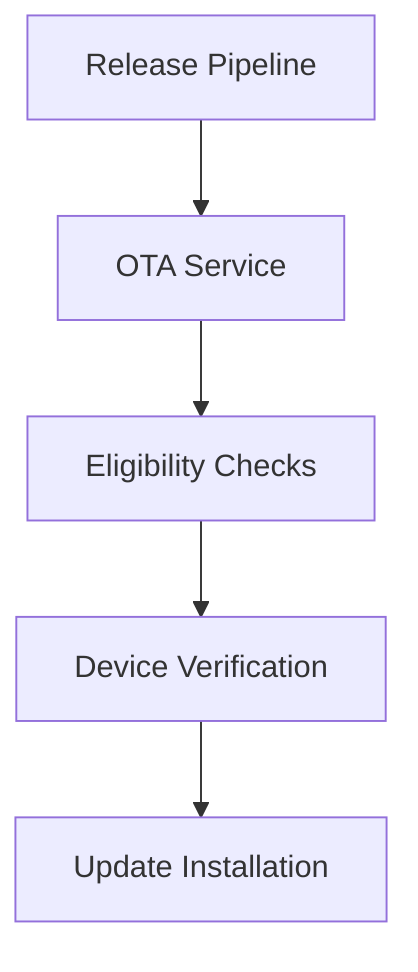

Enigm OS OTA is the controlled update architecture for securely delivering trusted software updates to eligible devices. OTA updates are part of the Enigm OS security model because Device Trust depends on software authenticity, software integrity, device eligibility, and governed rollout behavior.

This document is the entry point for the Enigm OS OTA documentation section. It is intended for Android engineers, security auditors, enterprise customers, and technical partners.

## Overview

OTA exists to securely deliver trusted software updates to eligible Enigm OS devices.

The OTA architecture supports:

- Secure software delivery.
- Controlled update distribution.
- Release authenticity.
- Release integrity.
- Device eligibility.
- Update trust.
- Rollout governance.

The diagram is conceptual and represents the trust flow for software delivery.

## Design Objectives

The OTA architecture is designed to:

- Ensure devices receive software released through authorized Enigm release workflows.
- Verify release authenticity before installation.
- Verify release integrity before installation.
- Support staged release deployment.
- Support device eligibility decisions.
- Support rollout governance.
- Preserve update trust as part of the Enigm OS security model.
- Keep update delivery separate from release signing.

OTA is a delivery and eligibility architecture. It does not replace production signing, local device verification, or Trust Security Center posture evaluation.

## OTA Architecture

Enigm OS OTA is organized around release preparation, authorized publication, eligibility evaluation, device verification, and update installation.

At a public architecture level:

- Release workflows prepare update artifacts for approved channels.
- Production signing establishes release authenticity.
- OTA distribution makes approved releases available to eligible devices.
- Eligibility checks determine whether a device should be offered a release.
- Device-side verification evaluates authenticity and integrity before installation.
- Controlled rollouts govern release exposure over time.

### OTA Purpose

OTA exists to securely deliver trusted software updates to eligible devices.

### Secure Software Delivery

The OTA architecture is designed to ensure that devices receive software released through authorized Enigm release workflows.

Secure software delivery depends on release authenticity, release integrity, device eligibility, and device verification. The delivery path alone is not treated as sufficient proof of trust.

## Device Eligibility

Not every device must automatically receive every release.

Eligibility may depend on:

- Device identity.
- Device integrity.
- Enrollment status.
- Release channel.
- Rollout policy.
- Remote Attestation.

Device eligibility supports controlled release exposure and helps ensure that updates are offered to devices appropriate for the release channel and trust requirements.

Eligibility does not replace device-side verification. A device that is eligible for a release is still expected to verify authenticity and integrity before installation.

## Release Authenticity

Release authenticity is the assurance that an update originates from an authorized Enigm release process.

Production signing establishes release authenticity. OTA delivery does not replace release signing.

Devices should treat release authenticity as a required condition before update installation.

## Release Integrity

Release integrity is the assurance that update content has not been altered from the approved release.

Devices are expected to verify release authenticity and integrity before applying updates.

Release integrity is a device-side trust requirement. OTA distribution provides access to releases, but the device must still verify that the received release matches the expected signed software.

## Controlled Rollouts

OTA supports staged release deployment.

Examples of rollout stages include:

- Draft releases.
- Validation releases.
- Limited rollouts.
- Stable releases.
- Security releases.

Controlled rollouts allow Enigm to govern release exposure, monitor release progression, and avoid unnecessary broad deployment before a release is ready for its target audience.

Rollout governance is separate from update authenticity. A staged rollout controls distribution timing and eligibility; signing and verification establish release trust.

## Relationship With Trust Security Center

Trust Security Center evaluates local device integrity and posture.

OTA evaluates release eligibility and supports secure software delivery.

These systems serve different purposes:

- Trust Security Center reports local Device Trust state.
- OTA determines whether a release should be offered and verified for installation.

Trust Security Center may surface update-related posture, but it does not replace OTA Eligibility or release verification.

## Relationship With Remote Attestation

Remote Attestation is an additional eligibility signal.

Remote Attestation complements OTA security controls by contributing device integrity evidence before a release is offered or installed when device-integrity evidence is required.

Remote Attestation does not replace release signing, device-side verification, or controlled rollout governance.

## Relationship With Production Signing

Production signing establishes release authenticity.

OTA delivery does not replace release signing. A release must be treated as trusted only when the required authenticity and integrity checks succeed.

Production signing, OTA Eligibility, device verification, and controlled rollout governance are separate but complementary controls in the Enigm OS update model.

## Security Limitations

OTA reduces software delivery risk, but it does not eliminate all update or device risk.

Limitations include:

- Eligible devices must still verify releases before installation.
- Controlled rollouts do not replace release authenticity.
- Release authenticity does not replace Device Trust evaluation.
- Remote Attestation is a signal, not a complete assurance of device safety.
- Update installation does not ensure that all future device behavior remains trusted.
- OTA does not protect against unsafe user decisions.
- OTA does not provide message plaintext access.
- OTA does not replace Enigm App end-to-end encryption.

OTA should be evaluated as one part of the Enigm OS security architecture, alongside production signing, Remote Attestation, Trust Security Center, platform hardening, and Enigm App security controls.
