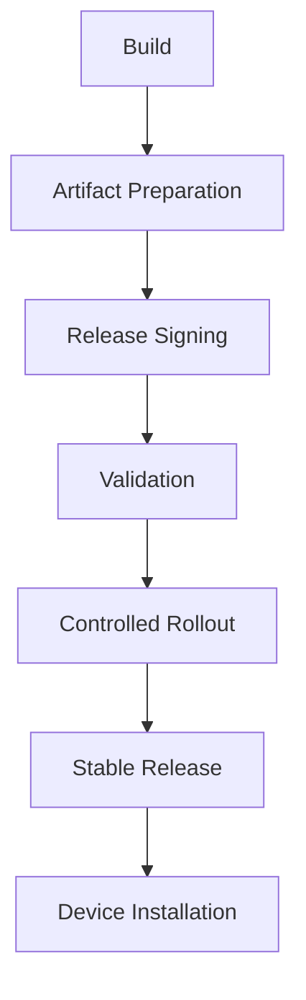

Enigm OS OTA releases are designed to move through a controlled lifecycle before becoming broadly available. The release lifecycle exists to reduce deployment risk, maintain software integrity, and govern how updates are validated, exposed, and installed.

This document is intended for Android engineers, security auditors, enterprise customers, and technical partners.

## Overview

The OTA release lifecycle describes how Enigm OS updates move from build creation to device installation.

The lifecycle covers:

- Build creation.
- Artifact preparation.
- Manifest creation.
- Release signing.
- Release registration.
- Validation.
- Controlled rollout.
- Stable release.
- Device installation.

The diagram is conceptual and represents release lifecycle responsibilities at a public architecture level.

## Release Objectives

The Enigm OS OTA release lifecycle is designed to:

- Reduce deployment risk.
- Maintain release integrity.
- Support release authenticity.
- Govern release publication.
- Support staged rollout models.
- Support device eligibility decisions.
- Support device-side verification before installation.
- Keep release deployment separate from message confidentiality.

The lifecycle does not replace OTA security controls. It organizes how those controls are applied across release stages.

## Release Stages

The release lifecycle includes the following conceptual stages.

### Stage 1: Build Creation

Build creation produces the software that may later become an OTA release.

This stage is the starting point for release governance. Software produced at this stage is not broadly available until release lifecycle controls are completed.

### Stage 2: Artifact Preparation

Artifact preparation organizes update content for release processing.

Artifacts are prepared for verification, signing, release metadata, and eligibility workflows.

### Stage 3: Manifest Creation

Manifest creation prepares release metadata describing the update that devices are expected to evaluate.

The manifest supports release discovery, release verification, artifact verification, and policy evaluation.

### Stage 4: Release Signing

Release signing authorizes release metadata, artifacts, or signing-critical release material according to the applicable signing authority.

Release signing establishes authenticity evidence. It does not by itself govern broad deployment.

### Stage 5: Release Registration

Release registration makes an approved release known to the OTA release model.

Registration is used to support discovery, eligibility evaluation, validation, and rollout governance.

### Stage 6: Validation

Validation evaluates whether the release is ready for controlled exposure.

Validation may include:

- Artifact integrity checks.
- Release verification.
- Eligibility verification.
- Device compatibility validation.
- Rollout policy validation.

### Stage 7: Controlled Rollout

Controlled rollout exposes the release according to rollout policy.

Not every eligible device must receive a release simultaneously. Controlled rollout supports staged availability and risk reduction.

### Stage 8: Stable Release

Stable release indicates that a release is broadly available for its intended population according to release policy.

Stable availability does not remove the need for device-side verification.

### Stage 9: Device Installation

Device installation occurs after an eligible device discovers a release and completes required verification.

Devices are expected to verify authenticity, integrity, and policy requirements before installation.

## Validation Process

Validation is a release readiness control.

Validation may include:

- Artifact integrity checks.
- Release verification.
- Eligibility verification.
- Device compatibility validation.
- Rollout policy validation.

Validation reduces risk before releases are exposed to wider device populations. It does not replace release signing or device-side verification.

## Rollout Strategy

The platform supports staged rollout models.

Examples include:

- Draft.
- Validation.
- Limited rollout.
- Stable rollout.
- Security rollout.

Not every eligible device must receive a release simultaneously. Rollout strategy allows release exposure to be governed by readiness, release type, eligibility, and risk posture.

Controlled rollout is separate from release authenticity. Rollout policy governs exposure; signing and verification establish trust.

## Device Installation

Eligible devices participate in the final stage of the release lifecycle.

Eligible devices:

- Discover releases.
- Verify release authenticity.
- Verify release integrity.
- Verify policy requirements.
- Install updates.

Device installation should only proceed after required release and policy checks succeed. Installation is part of the device-side trust model and should not rely solely on release availability.

## Release Governance

Release publication is governed by:

- Signing requirements.
- Validation requirements.
- Eligibility controls.
- Rollout controls.

Release governance ensures that a release moves through required controls before broad availability. It provides structure for when a release is created, authorized, validated, exposed, and installed.

## Relationship With OTA Security

The release lifecycle depends on OTA security controls.

Relevant controls include:

- Transport authentication.
- Request validation.
- Manifest verification.
- Artifact verification.
- Device eligibility.

The release lifecycle defines how releases move through governance stages. OTA security defines the controls that protect release discovery, metadata, artifacts, eligibility, and verification.

## Relationship With Remote Attestation

Remote Attestation may contribute additional eligibility signals before protected releases are exposed.

Remote Attestation helps evaluate whether a device is eligible for selected release channels, protected update metadata, private artifacts, or sensitive rollout paths when device-integrity evidence is required.

Remote Attestation does not replace release signing, validation, rollout policy, or device-side verification.

## Relationship With Release Signing

Release signing authorizes releases.

Release lifecycle governs release deployment.

These serve different functions:

- Release signing establishes authenticity evidence.
- Release lifecycle controls how releases are prepared, validated, exposed, and installed.

Both are required for a governed OTA update model. Signing without lifecycle governance can still expose releases incorrectly; lifecycle governance without signing does not establish release authenticity.

## Security Limitations

The release lifecycle reduces deployment risk, but it does not eliminate all release or update risk.

Limitations include:

- Validation may not detect every defect.
- Release signing does not prove that source code is free of vulnerabilities.
- Controlled rollout does not replace device-side verification.
- Device eligibility does not replace artifact integrity checks.
- Remote Attestation is an additional signal, not complete assurance.
- Stable release status does not remove the need for installation verification.
- Authorized releases may still contain unknown vulnerabilities.
- Release lifecycle controls do not provide message plaintext access.

The release lifecycle should be evaluated alongside OTA security controls, Remote Attestation, production signing, Trust Security Center, and Enigm OS platform hardening.
