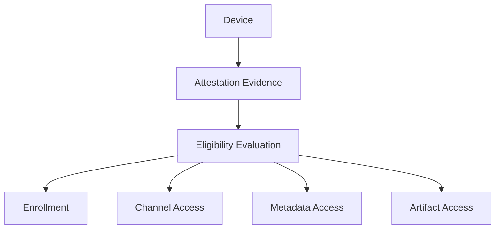

The Enigm OS OTA architecture supports Remote Attestation as an additional production hardening layer. Remote Attestation helps determine whether a device is eligible for enrollment, registration, protected update metadata, private update artifacts, or sensitive rollout channels.

Remote Attestation is a production eligibility control for selected protected workflows. This document does not claim that every production device is necessarily attested on every request.

This document is intended for Android engineers, security auditors, enterprise customers, and technical partners.

## Overview

Remote Attestation supports eligibility decisions based on device-produced security evidence.

Within the Enigm OS OTA model, Remote Attestation helps determine whether a device is eligible to:

- Enroll.
- Register.
- Access protected update metadata.
- Receive private update artifacts.
- Access sensitive rollout channels.

The diagram is conceptual and describes eligibility flow at a public architecture level.

## Security Purpose

Remote Attestation evaluates selected security and eligibility signals, including:

- Device integrity.
- Verified software state.
- Device identity signals.
- Enrollment status.
- Rollout eligibility.
- Channel eligibility.
- Update authorization.

The backend requires Remote Attestation for selected protected workflows according to eligibility policy. Attestation helps determine eligibility, but it is evaluated alongside other OTA security controls.

## Relationship With OTA Security

Remote Attestation complements but does not replace:

- Transport authentication.
- Request authentication.
- Manifest verification.
- Artifact verification.
- Hardware-Backed Signing.
- Rollout policy.
- Device enrollment controls.

Remote Attestation is an additional eligibility signal. It does not make unsigned metadata, unsigned artifacts, weak transport authentication or uncontrolled rollout policy acceptable.

OTA security remains a layered model. Attestation contributes device integrity evidence, while signing, verification, authentication, and rollout governance protect other parts of the update lifecycle.

## Device Eligibility

Remote Attestation can be used to determine eligibility for security-sensitive OTA workflows.

Eligibility may include:

- Enrollment eligibility.
- Registration eligibility.
- Protected metadata access.
- Private artifact access.
- Sensitive rollout channel access.
- Release channel eligibility.
- Update authorization.

Device eligibility should not rely only on attestation. Eligibility decisions should consider enrollment state, Privacy-Preserving Device Handles, rollout policy, channel policy, and request context.

## Attestation Evidence

Attestation evidence may include:

- Hardware-backed device identity signals.
- Device integrity signals.
- Verified software state.
- Device lock state.
- Build identity.
- Patch level.
- Device model.
- Device eligibility.
- Freshness signals.

Attestation evidence should be interpreted as security evidence for eligibility decisions. It should not be treated as a substitute for manifest verification, artifact verification, or release signing.

## Verification Requirements

The backend should verify attestation evidence before using it for eligibility decisions.

Verification requirements may include:

- Attestation authenticity.
- Certificate chain validity.
- Root of trust.
- Device integrity.
- Enrollment binding.
- Privacy-Preserving Device Handle binding.
- Freshness.
- Channel eligibility.
- Device eligibility.

Conceptual rejection conditions include:

- Invalid trust chain.
- Unsupported device.
- Ineligible build.
- Stale attestation.
- Replay attempt.
- Eligibility failure.

The exact verification logic is not documented publicly.

## Replay Protection

Attestation evidence should be freshness-sensitive.

The server may require:

- Nonce.
- Challenge-response.
- Transaction binding.

Freshness controls are intended to reduce risk from reused evidence. Replay protection should be evaluated together with request authentication, request integrity, and device eligibility.

## Relay Protection

A valid attestation proves that eligible hardware produced the evidence. It does not automatically prove that the current requester is the same enrolled device.

Additional bindings may be required:

- Enrollment binding.
- Device handle binding.
- Transport identity binding.
- Request binding.

Relay protection is intended to reduce risk where valid evidence is forwarded, reused, or presented outside the expected device context.

## Privacy Model

Remote Attestation is intended to support security eligibility decisions, not user content collection.

Attestation is not intended to collect:

- Message content.
- Media content.
- Contact data.
- User behavior telemetry.

Privacy principles include:

- Use Privacy-Preserving Device Handles for device correlation.
- Minimize device telemetry required for eligibility.
- Scope attestation processing to security and lifecycle decisions.
- Prefer policy outcomes over long-term storage of raw attestation payloads.
- Keep attestation data separate from message confidentiality.

Long-term storage should prefer policy outcomes rather than raw attestation payloads.

## Relationship With Trust Security Center

Trust Security Center evaluates local integrity.

Remote Attestation evaluates OTA Eligibility.

These systems serve different purposes:

- Trust Security Center provides local device posture visibility.
- Remote Attestation can provide server-evaluated eligibility evidence for selected workflows.

Trust Security Center may surface relevant local posture, while Remote Attestation may contribute evidence for enrollment, registration, metadata access, artifact access, and rollout channel eligibility.

## Security Limitations

Remote Attestation is a security hardening layer, not a complete security solution.

Limitations include:

- It may not be required on every production request.
- It does not replace transport authentication.
- It does not replace request authentication.
- It does not replace manifest verification.
- It does not replace artifact verification.
- It does not replace Hardware-Backed Signing.
- It does not replace rollout policy.
- It does not replace device enrollment controls.
- It does not prove that released software is free of vulnerabilities.
- It does not prevent malicious authorized users from misusing access.
- It does not provide message plaintext access.

Remote Attestation should be evaluated as a production hardening layer within the broader Enigm OS OTA security model.
