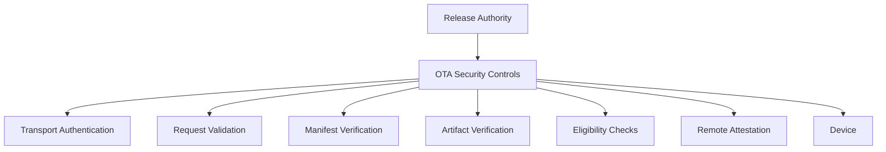

Enigm OS OTA security is a layered defense architecture for delivering trusted software updates to eligible devices. It does not rely on a single mechanism. OTA security depends on multiple independent controls that support release authenticity, request integrity, artifact integrity, device eligibility, rollout governance, and device-side verification.

This document is intended for Android engineers, security auditors, enterprise customers, and technical partners.

## Overview

The OTA security model is designed to reduce risk across the update lifecycle.

The model protects:

- Software delivery.
- Release metadata.
- Update artifacts.
- Device eligibility.
- Rollout decisions.
- Device verification.
- Trusted release origin.

OTA security is part of the broader Enigm OS security architecture. It complements production signing, Remote Attestation, Trust Security Center, device management, and platform hardening.

## Security Objectives

The OTA security architecture is designed to:

- Provide assurance that updates originate from authorized Enigm release workflows.
- Protect release metadata from unauthorized modification.
- Support device-side artifact verification.
- Support request validation and replay resistance.
- Support device eligibility decisions.
- Support controlled rollout governance.
- Reduce unnecessary device identity exposure.
- Keep update trust separate from message confidentiality.

OTA security does not provide access to Enigm App message plaintext and does not replace application-level encryption.

## Defense-in-Depth Model

OTA security relies on multiple independent controls.

### Layer 1: Transport Authentication

Transport authentication protects communication between the device and OTA delivery surfaces.

This layer supports:

- Authenticated transport.
- Protected communication channels.
- Request authentication.

Transport authentication reduces exposure to network-level tampering and unauthorized request paths. It is not treated as sufficient by itself.

### Layer 2: Request Verification

Request verification evaluates whether an OTA request should be trusted for processing.

This layer supports:

- Request validation.
- Freshness validation.
- Replay resistance.
- Request integrity.

Request verification is intended to reduce risk from reused, malformed, or unauthorized update requests.

### Layer 3: Manifest Trust

Manifest trust protects release metadata.

This layer supports:

- Signed release metadata.
- Release authenticity.
- Release authorization.

The manifest describes what the device is expected to verify and install. Manifest trust helps ensure that the device evaluates authorized release metadata.

### Layer 4: Artifact Verification

Artifact verification protects update content.

This layer supports:

- Hash verification.
- Integrity validation.
- Corruption detection.

Artifact verification is performed before update installation. It provides assurance that downloaded update content matches the expected release.

### Layer 5: Device Eligibility

Device eligibility determines whether a device should be offered a specific release.

This layer evaluates:

- Enrollment status.
- Device Trust.
- Channel eligibility.
- Rollout policy.

Eligibility helps control which devices receive which releases and supports staged deployment governance.

### Layer 6: Remote Attestation

Remote Attestation provides an additional eligibility signal.

This layer supports:

- Device integrity validation.
- Enrollment verification.
- Additional trust evidence for release eligibility.

Remote Attestation complements OTA security controls. It does not replace manifest verification, artifact verification, or production signing.

### Layer 7: Production Signing

Production signing establishes trusted release origin.

This layer supports:

- Release authorization.
- Hardware-Backed Signing.
- Trusted release origin.

Production signing is a release authenticity control. OTA delivery does not replace signing, and devices should only treat releases as trusted when required verification succeeds.

## Trust Boundaries

OTA security separates release authority, OTA security controls, eligibility evaluation, device verification, and update installation.

The diagram is conceptual. It describes security responsibilities rather than implementation topology.

Trust boundaries include:

- Release authority and production signing.
- OTA request handling.
- Release metadata verification.
- Artifact verification.
- Eligibility evaluation.
- Remote Attestation.
- Device-side installation.

These boundaries reduce reliance on any single trust decision.

## Device Eligibility

Device eligibility determines whether a device should receive a given release.

Eligibility may be based on:

- Enrollment status.
- Device Trust.
- Channel eligibility.
- Rollout policy.
- Remote Attestation as an additional OTA Eligibility signal.

Device eligibility is separate from artifact verification. A device can be eligible for a release and still be required to verify release metadata and artifact integrity before installation.

## Transport Security

Transport security protects OTA communication channels.

Transport security is designed to support authenticated communication and reduce network tampering risk. It must be combined with request verification, manifest trust, artifact verification, eligibility checks, and production signing.

Transport security alone is not sufficient to establish release trust.

## Request Authentication

Request authentication supports trust in update request handling.

It is designed to ensure that OTA requests are associated with an eligible device context and that requests are validated before release information is returned.

Request authentication should be evaluated alongside freshness validation, replay resistance, request integrity, Device Trust, OTA Eligibility, and Remote Attestation when device-integrity evidence is required.

## Manifest Security

Manifest security protects release metadata.

Release metadata should be signed and authorized through the release workflow. Devices are expected to verify manifest trust before relying on release metadata.

Manifest security supports release authenticity and release authorization, but it does not replace artifact verification.

## Artifact Integrity

Artifact integrity protects the update payload.

Devices are expected to verify update artifacts before installation. Hash verification, integrity validation, and corruption detection provide assurance that the received artifact matches the expected release.

Artifact integrity reduces risk from corrupted or modified update content. It does not replace production signing or device eligibility.

## Rollout Controls

Rollout controls govern release exposure over time.

Rollout controls may support:

- Draft release handling.
- Validation release handling.
- Limited rollout exposure.
- Stable release distribution.
- Security release prioritization.
- Channel eligibility.
- Deployment governance.

Rollout controls reduce release risk by limiting exposure according to release readiness and policy. Rollout controls do not replace authenticity or integrity verification.

## Device Identity

Device identity is used to support eligibility and update trust decisions.

OTA should use Privacy-Preserving Device Handles for device correlation. Device identifiers should be scoped to OTA Eligibility and device lifecycle needs rather than unnecessary identity collection.

Device identity in OTA is not message identity and must remain separate from Enigm App message confidentiality.

## Privacy Model

The OTA privacy model is based on minimizing the information needed for update eligibility and delivery.

Privacy principles include:

- Use Privacy-Preserving Device Handles for device correlation.
- Minimize device telemetry.
- Support eligibility decisions without unnecessary identity collection.
- Keep update eligibility separate from message content.
- Avoid collecting user conversation, media, call, attachment, or document content.

OTA may require device state sufficient to determine eligibility and update trust. That state should remain limited to update security and lifecycle purposes.

## Security Limitations

OTA security reduces risk across software delivery, but it does not eliminate all security risk.

OTA security does not eliminate:

- Device compromise.
- Malicious authorized users.
- Vulnerable software released through authorized processes.
- Future unknown vulnerabilities.
- Unsafe user decisions after update installation.
- Exposure from systems outside Enigm control.

Additional limitations:

- Transport security alone is insufficient for update trust.
- Eligibility does not replace artifact verification.
- Remote Attestation provides an additional signal, not complete assurance.
- Production signing establishes trusted release origin, but it does not prove that released software is free of defects.
- OTA security does not provide access to message plaintext.
- OTA security does not replace Enigm App end-to-end encryption.

OTA security should be evaluated as a layered architecture combining transport authentication, request verification, manifest trust, artifact verification, eligibility checks, Remote Attestation, production signing, and device-side validation.
