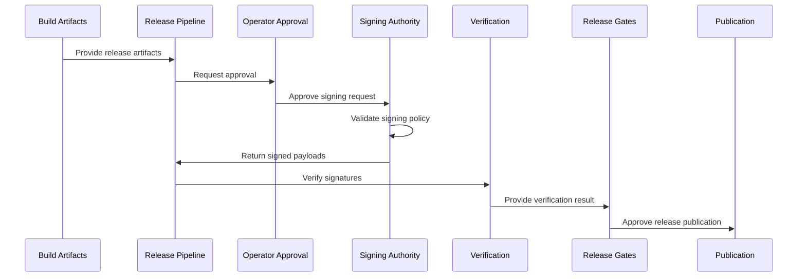

Enigm OS uses Hardware-Backed Signing as part of its release security model. The architecture intentionally separates different signing authorities so that manifest authorization and production release signing are not treated as the same control.

Production systems must not confuse manifest signing authority with image or release signing authority. These authorities serve different purposes and belong to different trust boundaries.

This document is intended for Android engineers, security auditors, enterprise customers, and technical partners.

## Overview

Signing provides release authorization and authenticity evidence for Enigm OS software delivery.

The Enigm OS signing model distinguishes between:

- Current Production OTA Manifest Signing Model.
- Target Production HSM Release-Signing Architecture.

The current model authorizes OTA manifests and release metadata. The target production model is intended to authorize production images, OTA payloads, and signing-critical release artifacts through a dedicated physical hardware security module.

## Signing Authorities

Enigm OS separates signing authorities by purpose.

### Current Authority: OTA Manifest Signing Authority

The OTA Manifest Signing Authority authorizes OTA manifests and release metadata.

This authority is responsible for:

- Manifest authorization.
- Metadata authorization.
- Release metadata authenticity.
- Approval evidence for OTA release metadata.

This authority is not the same as the target production release-signing authority.

### Target Authority: Production Release-Signing Authority

The Production Release-Signing Authority is the target authority for production image and release artifact signing.

This authority is intended to be responsible for:

- Production image signing.
- OTA payload signing.
- Signing-critical release artifacts.
- Production release authorization.

This authority is intended to operate through a dedicated physical HSM and must remain distinct from the OTA Manifest Signing Authority.

## Current Production OTA Manifest Signing Model

The current Enigm OS OTA model uses PIV-backed hardware security key offline manifest signing.

This model provides:

- Hardware-backed offline signing.
- Physical operator participation.
- Non-exportable key material.
- Manifest and metadata authorization.
- Separation from release-signing workflows.

The current model authorizes OTA manifests and metadata. It provides release authenticity for the manifest layer, not full production image signing authority.

### Protected Signing Material

The manifest signing key must not be stored in:

- Git repositories.
- CI/CD variables.
- Build scripts.
- Developer workstations.
- Online object storage.
- Release artifacts.

The signing authority should remain hardware-backed and operator-mediated. Systems that prepare manifests may request signing, but they must not gain access to private key material.

### Relationship With Other OTA Controls

Manifest signing complements:

- Transport authentication.
- Request authentication.
- Artifact verification.
- Rollout controls.
- Device eligibility.
- Remote Attestation.

Manifest signing does not replace these controls. It authorizes manifest metadata and supports release authenticity at the metadata layer.

## Target Production HSM Release-Signing Architecture

The target Enigm OS production release-signing architecture is designed to use a dedicated physical HSM.

The target architecture is intended to support:

- Non-exportable production keys.
- Release authorization.
- Production image signing.
- OTA payload signing.
- Signing-critical release artifacts.

Intended production governance capabilities include:

- Dual control.
- Multi-party approval.
- Audit logs.
- Key ceremonies.
- Secure backup procedures.
- Release governance.

The target Production Release-Signing Authority is not the same authority as the current OTA Manifest Signing Authority. The target authority is intended to act as the release authorization root of trust for production artifacts.

## Production Signing Trust Boundary

Production signing must have a clear trust boundary.

### Inside The Trust Boundary

Inside the production signing trust boundary:

- Physical HSM.
- Non-exportable private keys.
- Approved signing policies.
- Authenticated operators.
- Audit records.
- Key ceremonies.

### Outside The Trust Boundary

Outside the production signing trust boundary:

- Build systems.
- CI runners.
- Artifact repositories.
- OTA services.
- Developer workstations.
- Source repositories.
- Release scripts.

Systems outside the trust boundary may request signatures but must never access private keys.

## Signing Flow

The conceptual signing flow is:

1. Build artifacts are produced.
2. Release pipeline prepares signing payloads.
3. Operator approval occurs.
4. Signing authority validates policy.
5. Signing authority signs.
6. Verification occurs.
7. Release gates execute.
8. Release is published.

The sequence is conceptual and describes security responsibilities at a public architecture level.

## Threat Model

The signing architecture is intended to mitigate:

- Private key theft.
- CI compromise.
- Developer workstation compromise.
- Repository compromise.
- Unauthorized signing.
- Test-key misuse.
- Artifact replacement.

Residual risks include:

- Malicious source code.
- Authorized operator abuse.
- Misconfigured policy.
- Verification defects.
- Signing authority compromise.

Hardware-Backed Signing reduces key exposure and supports release authorization, but it does not prove that released software is free of defects or malicious logic introduced before signing.

## Security Limitations

Hardware-Backed Signing acts as a release authorization root of trust. It does not replace:

- Verified boot.
- Artifact verification.
- Remote Attestation.
- Device eligibility.
- Rollout controls.
- OTA verification.
- Request authentication.
- Transport authentication.

Additional limitations:

- Manifest signing authority and release-signing authority must remain distinct.
- Signed metadata does not prove artifact integrity unless the artifact verification gates succeed.
- Signed artifacts do not prove that source code is free of vulnerabilities.
- Operator-mediated workflows still require governance and audit review.
- Hardware-Backed Signing does not prevent misuse by authorized operators.

Enigm OS production signing treats the private release key as hardware-resident authority. Production artifacts are trusted only when they are signed through the approved Hardware-Backed Signing workflow and pass the corresponding verification gates.
