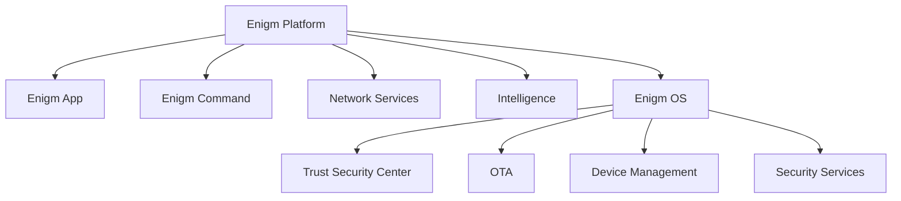

Enigm OS is a dedicated secure device platform within the Enigm ecosystem. It is designed to provide an additional layer of Device Trust, platform hardening, and operational security for users and deployments that require a controlled device environment.

Enigm OS is not the primary Enigm product. Enigm App remains the primary user-facing product for secure messaging, secure calls, account workflows, device association, and core user interaction.

This document is intended for security auditors, enterprise customers, technical partners, and Android engineers. It describes Enigm OS at a public architecture level suitable for external review.

## Overview

Enigm OS provides device-level security controls that can strengthen the Enigm ecosystem where a dedicated secure device layer is required.

Enigm OS is:

- A dedicated secure device platform.
- A source of Device Trust signals.
- A platform hardening layer.
- A controlled device experience.
- A host for additional device security controls.

Enigm OS is not:

- A replacement for Enigm App.
- A replacement for end-to-end encryption.
- A replacement for secure messaging architecture.
- A replacement for user trust decisions.
- A replacement for security awareness.

## Design Objectives

Enigm OS is designed to:

- Provide platform hardening for supported devices.
- Provide Device Trust signals to Enigm App and Enigm Command.
- Reduce attack surface through a controlled device experience.
- Support managed device capabilities.
- Support Trust Security Center visibility.
- Support OTA security and update verification.
- Support device-level network and privacy controls.
- Support operational security for users who require a dedicated secure device layer.

## Security Philosophy

Enigm OS follows a defense-in-depth model. It adds device-level controls to the broader Enigm architecture rather than replacing app-level cryptography or user-level trust decisions.

The security philosophy is:

- Keep Enigm App as the primary user-facing product.
- Use Enigm OS to strengthen Device Trust where deployed.
- Keep device controls separate from message plaintext.
- Treat OS posture as an additional signal, not as a universal assurance.
- Preserve auditability for managed device and security-relevant state changes.

## Device Trust

Enigm OS can contribute Device Trust signals to Enigm App, Enigm Command, and managed device workflows.

Device Trust signals may include:

- Trust Security Center posture.
- Device management state.
- Network policy state.
- Privacy mode state.
- OTA verification state.
- Remote Attestation outcome when device-integrity evidence is required.
- Security service state.

Device Trust does not replace Account Trust. A valid account session and a trusted device state are separate concepts.

## Platform Hardening

Enigm OS provides platform hardening for supported deployments.

Platform hardening may include:

- Controlled device experience.
- Reduced attack surface.
- Security service enforcement.
- Network policy controls.
- Privacy controls.
- Launcher and setup controls.
- Update verification.
- Device management integration.

Platform hardening is intended to reduce risk. It does not remove all endpoint risk.

## Managed Device Capabilities

Enigm OS can support managed device capabilities for deployments that require device lifecycle control.

Managed device capabilities may include:

- Device enrollment state.
- Device revocation state.
- Device replacement state.
- Device security reporting.
- Managed policy state.
- Remote wipe support where enabled.
- Enigm Command visibility.

Managed device capabilities must remain separate from message plaintext access. Device management is not a mechanism for bypassing end-to-end encryption.

## Relationship With Enigm App

Enigm App remains the primary user-facing product.

Enigm OS can provide additional device posture and hardening signals to Enigm App where deployed. These signals can inform Device Trust, secure messaging eligibility, secure call eligibility, and managed device policy.

Enigm App secure messaging and secure calls must remain app-level security models. Enigm OS can strengthen endpoint posture, but it does not replace protected key material, end-to-end encryption, verification workflows, or user trust decisions.

## Relationship With The Enigm Ecosystem

Enigm OS integrates with several Enigm ecosystem components.

### Enigm Command

Enigm Command can use Enigm OS device state for trusted device visibility, managed device operations, device lifecycle review, and security reporting.

### Trust Security Center

Trust Security Center provides user-visible and administrator-reviewable device security posture.

### OTA

OTA provides update lifecycle, signing, verification, release review, and controlled rollout behavior for Enigm OS updates.

### Device Management

Device Management supports enrollment, revocation, replacement, reporting, and managed device capabilities.

### Enigm Intelligence

Enigm Intelligence can consume approved security telemetry and device posture signals to support security monitoring, risk assessment, and defensive response.

### VPN and Network Services

VPN Service, Proxy Network, Enigm eSIM, and Tor Gateway are separate platform components. Enigm OS may provide device-level network policy or posture signals, but network services and selected web access paths remain distinct from OS trust and app-level cryptography.

## Security Limitations

Enigm OS provides platform hardening, Device Trust signals, reduced attack surface, controlled device experience, and additional security controls. It does not replace:

- End-to-end encryption.
- User trust decisions.
- Secure messaging architecture.
- Security awareness.
- Account security.
- Protected key material.
- Verification workflows.

Important limitations:

- A compromised endpoint may still expose data after authorized local access.
- Device posture is a signal, not an absolute assurance.
- Managed device controls depend on device state and policy.
- Remote wipe, where enabled, cannot ensure removal of content already exported or captured outside Enigm controls.
- Enigm OS hardening does not make insecure user behavior safe.
- Enigm OS does not make administrative systems a plaintext message access path.

## Threat Model References

Relevant threat-model areas include Enigm OS policy bypass, device lifecycle abuse, OTA integrity failure, Enigm Command abuse, account and app compromise, network-policy misuse, and loss of audit visibility.
