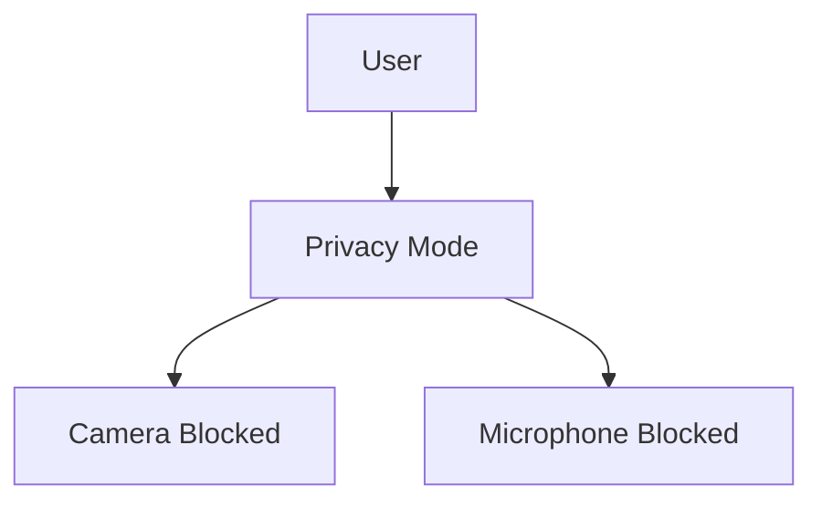

Privacy Mode is a fast-access privacy protection feature in Enigm OS. It is intended to reduce exposure from sensitive device sensors during normal operation.

Privacy Mode is not intended to disable all device functionality. It provides rapid user control over selected sensitive capture resources.

This document is intended for Android engineers, security auditors, enterprise customers, and technical partners.

## Overview

Privacy Mode provides a clear device state for reducing exposure from sensitive sensors.

When Privacy Mode is active:

- Camera access is blocked.
- Microphone access is blocked.

Privacy Mode is designed to be understandable, quick to activate, and visible when active. It does not replace broader Enigm OS platform hardening or Enigm App cryptographic controls.

## Design Objectives

Privacy Mode is designed to:

- Provide rapid user control over sensitive sensor access.
- Reduce exposure from camera and microphone capture.
- Present a clear visual indication when active.
- Keep user interaction simple.
- Support Trust Security Center visibility.
- Avoid unnecessary complexity.
- Avoid implying protection outside its defined scope.

### Privacy Mode Purpose

Privacy Mode exists to provide rapid user control over sensitive sensor access.

It is designed for situations where users want additional assurance that sensitive capture devices are unavailable. The feature focuses on reducing sensor exposure during normal operation rather than disabling the entire device.

## Sensor Protection Model

Privacy Mode protects selected sensitive capture resources.

### Protected Resources

When Privacy Mode is active:

- Camera access is blocked.
- Microphone access is blocked.

The protection model is intentionally scoped. It focuses on sensitive capture devices that can expose visual or audio information from the user’s environment.

### Non-Goals

Privacy Mode is not intended to:

- Replace Device Trust.
- Replace end-to-end encryption.
- Replace secure messaging.
- Replace operating system security controls.
- Disable all device functionality.
- Provide protection against every form of data exposure.

Privacy Mode should be evaluated as one privacy control within the broader Enigm OS security architecture.

## User Experience

Privacy Mode should:

- Be easy to understand.
- Be easy to activate.
- Provide clear visual indication when active.
- Avoid unnecessary complexity.
- Communicate its scope clearly.
- Avoid overstating protection.

The user experience should make it clear when Privacy Mode is active and what resources are affected.

## Relationship With Trust Security Center

Trust Security Center may report Privacy Mode status as part of overall device security visibility.

Privacy Mode itself does not calculate Device Trust. Trust evaluation remains the responsibility of Trust Security Center and related Enigm OS security services.

Privacy Mode status may be one signal within device posture, but it is not sufficient by itself to determine whether the device should be treated as trusted.

## Relationship With Enigm App

Enigm App remains the primary user-facing product in the Enigm ecosystem.

Privacy Mode can reduce sensor exposure while the device is used for Enigm App workflows, but it does not replace Enigm App secure messaging, secure calls, account security, protected key material, or end-to-end encryption.

When Privacy Mode is active, camera and microphone availability may affect workflows that require those resources. The user experience should make this state clear.

## Security Limitations

Privacy Mode reduces exposure from selected sensors, but it does not eliminate all privacy or security risk.

Limitations include:

- It does not replace Device Trust evaluation.
- It does not replace Trust Security Center.
- It does not replace Enigm App end-to-end encryption.
- It does not protect against social engineering.
- It does not prevent disclosure by trusted participants.
- It does not provide assurance for systems outside Enigm control.
- It does not disable all device functionality.
- It does not address every possible source of device data exposure.

Privacy Mode should be interpreted as a fast-access control for sensitive sensor exposure, used alongside Enigm OS hardening, Trust Security Center posture, network policy, and Enigm App security controls.
