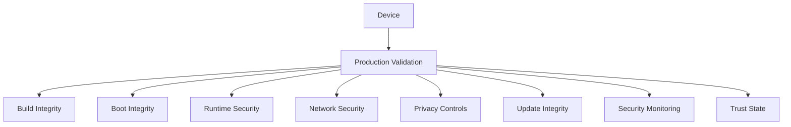

Production Gates define the conditions that must be satisfied before a device can be considered compliant with the intended Enigm OS production security posture.

The Production Gate Model describes security objectives and validation categories. It is not a publication of internal validation logic, executable checks, or low-level platform values.

This document is intended for Android engineers, security auditors, enterprise customers, and technical partners.

## Overview

Production Gates provide a structured model for evaluating whether an Enigm OS device aligns with the intended production security posture.

The model focuses on:

- Build integrity.
- Boot integrity.
- Runtime security.
- Platform configuration.
- Network security.
- Application exposure.
- Privacy controls.
- Device management.
- Update integrity.
- Security monitoring.

The diagram is conceptual and represents validation categories at a public architecture level.

## Production Gate Philosophy

Production Gates are based on the principle that production trust requires multiple independent validation categories.

The model is intended to:

- Reduce reliance on any single security signal.
- Improve confidence in device security posture.
- Support consistent production readiness evaluation.
- Support Trust Security Center visibility.
- Support OTA and update trust.
- Support managed-device review.
- Avoid treating production state as a one-time decision.

Passing a gate means that the relevant security objective is satisfied according to the production validation model. It does not mean that risk is eliminated.

## Gate Categories

### Gate 1: Build Integrity

Objectives:

- Production build.
- Trusted release state.
- Authorized release provenance.

Build Integrity evaluates whether the device software corresponds to an authorized production release state.

### Gate 2: Boot Integrity

Objectives:

- Verified software state.
- Trusted boot chain.
- Device integrity.

Boot Integrity evaluates whether the device starts from an expected trusted software state.

### Gate 3: Runtime Security

Objectives:

- Security services operational.
- Policy compliance.
- Runtime trust.

Runtime Security evaluates whether required security services and runtime policy conditions are operating as expected.

### Gate 4: Platform Configuration

Objectives:

- Security-focused configuration.
- Restricted exposure.
- Controlled platform state.

Platform Configuration evaluates whether the device configuration aligns with the intended controlled secure device platform.

### Gate 5: Network Security

Objectives:

- Trusted network configuration.
- Secure name resolution.
- Network policy compliance.

Network Security evaluates whether the device network posture supports the Enigm OS network security and privacy model.

### Gate 6: Application Exposure

Objectives:

- Controlled application surface.
- Restricted privileged functionality.
- Reduced attack surface.

Application Exposure evaluates whether the device limits unnecessary app and privileged functionality exposure.

### Gate 7: Privacy Controls

Objectives:

- Protected sensors.
- Privacy feature availability.
- Security visibility.

Privacy Controls evaluate whether device-level privacy protections are available and visible as expected.

### Gate 8: Device Management

Objectives:

- Managed-device compliance.
- Device lifecycle visibility.
- Security reporting.

Device Management evaluates managed-device posture for enrolled devices. It is applicable where managed-device capability is enabled.

### Gate 9: Update Integrity

Objectives:

- OTA Eligibility.
- Update authenticity.
- Update integrity.

Update Integrity evaluates whether the update lifecycle and device update posture align with Enigm OS OTA security requirements.

### Gate 10: Security Monitoring

Objectives:

- Trust evaluation.
- Security findings.
- Device integrity visibility.

Security Monitoring evaluates whether device posture signals can be assessed and surfaced through the security visibility model.

## Production Validation Model

Production validation should evaluate the device across the gate categories rather than relying on a single pass or fail condition.

Validation categories should support:

- Device Trust decisions.
- Production readiness decisions.
- Security posture reporting.
- Managed-device review.
- OTA Eligibility and update posture.
- Trust Security Center state evaluation.

Production validation should remain high-level in public documentation. Exact validation mechanics, platform values, and internal gate logic are not published.

## Security Objectives

The Production Gate Model is designed to:

- Define expected production security posture.
- Support consistent device compliance evaluation.
- Reduce risk from unmanaged device states.
- Improve confidence in software and runtime trust.
- Support security visibility for users and administrators.
- Support update and lifecycle governance.
- Keep device compliance separate from message confidentiality.

Production Gates do not provide access to message plaintext and do not replace Enigm App end-to-end encryption.

## Evidence Model

Production validation should rely on:

- Security signals.
- Device state.
- Trust evaluations.
- Compliance checks.
- Policy outcomes.

Evidence should support security posture decisions without exposing unnecessary user content or sensitive validation mechanics.

Production evidence is intended to support trust state, compliance review, and security visibility. It should not include message content, media content, call content, attachments, documents, or user conversations.

## Relationship With Trust Security Center

Trust Security Center consumes security signals.

Production Gates define expected security posture.

These systems are related but serve different purposes:

- Production Gates define the categories and objectives of expected production compliance.
- Trust Security Center evaluates and presents local Device Trust state.

Trust Security Center may surface results or findings related to production posture, but it is not a publication of gate logic.

## Relationship With OTA

OTA contributes software authenticity, update integrity, eligibility, and controlled delivery.

Production Gates contribute device compliance.

These systems are complementary:

- OTA helps ensure that trusted software is delivered and verified.
- Production Gates help evaluate whether the device remains aligned with the intended production security posture.

OTA security does not replace production compliance validation, and Production Gates do not replace OTA signing or client verification.

## Relationship With Device Management

Device Management may use production posture information for enrolled managed devices where enabled.

Managed-device workflows may use gate-related posture to support:

- Device lifecycle visibility.
- Security reporting.
- Device review.
- Remote operations where enabled.

Administrative device management must remain separate from message confidentiality. Production compliance visibility does not provide message plaintext access.

## Security Limitations

Passing all Production Gates does not ensure the absence of vulnerabilities.

Production Gates reduce risk and improve confidence in device security posture, but they do not eliminate:

- Future unknown vulnerabilities.
- Malicious authorized users.
- Vulnerable software released through authorized workflows.
- Social engineering.
- Physical coercion.
- Defects in validation logic.
- Security decisions made outside Enigm controls.

Additional limitations:

- Production Gates do not replace verified boot.
- Production Gates do not replace OTA verification.
- Production Gates do not replace Remote Attestation.
- Production Gates do not replace Enigm App end-to-end encryption.
- Production Gates do not provide message plaintext access.
- Production Gates should be evaluated alongside Trust Security Center, OTA, device management, platform hardening, and user trust decisions.
