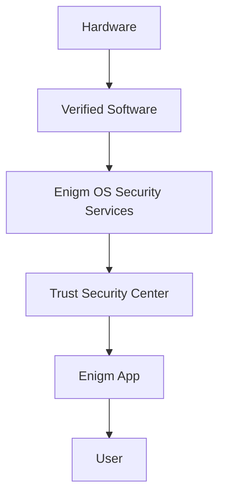

Enigm OS is a controlled secure device platform within the Enigm ecosystem. It is designed to provide additional Device Trust, platform hardening, and security control for users and deployments that require a dedicated secure device layer.

Enigm OS is not the primary Enigm product. Enigm App remains the primary user-facing product for secure messaging, secure calls, account workflows, and user interaction. Enigm OS strengthens the device environment in which Enigm App and managed device workflows may operate.

## Overview

Enigm OS establishes Device Trust through multiple independent security layers. These layers are intended to make device state observable, enforce security policy, reduce unnecessary system exposure, and support controlled update and device lifecycle operations.

The architecture focuses on:

- Device integrity.
- Verified software state.
- Protected key material.
- Operating system hardening.
- Network and policy controls.
- Trust Security Center visibility.
- Application-level security support.
- Controlled production release requirements.

Enigm OS does not replace end-to-end encryption, protected Enigm App key material, user verification workflows, or account-level security controls.

## Security Objectives

The primary security objectives of Enigm OS are:

- Provide a controlled secure device platform for supported deployments.
- Establish Device Trust using layered security signals.
- Reduce attack surface through platform hardening.
- Enforce security-focused defaults.
- Support secure device management and lifecycle operations.
- Support Trust Security Center posture visibility.
- Support protected OTA update verification and controlled rollout behavior.
- Preserve separation between device administration and message confidentiality.

These objectives are designed to support security review, enterprise governance, and operational control at a public architecture level.

## Security Architecture

Enigm OS security architecture is organized around device state, software trust, policy enforcement, and user-facing security visibility.

At a high level:

- Hardware and device integrity provide the lowest-level Device Trust foundation.
- Verified software state provides assurance that the device is running trusted production software.
- Operating system hardening reduces exposure from unnecessary capabilities and unsafe defaults.
- Network and policy controls constrain device behavior according to security policy.
- Trust Security Center presents security posture and trust state to users and administrators.
- Enigm App uses app-level cryptography and protected key material independently of OS-level controls.

The diagram is conceptual. It describes trust flow at a public architecture level.

## Trust Boundaries

Enigm OS separates the following trust domains:

- Hardware and device integrity.
- Verified software state.
- Operating system security services.
- Trust Security Center posture visibility.
- Enigm App cryptographic workflows.
- User decisions and verification actions.
- Enigm Command device lifecycle management.
- OTA release and verification lifecycle.

These boundaries are important because no single layer is treated as sufficient for complete platform trust. Device Trust is built from multiple signals, and application-level confidentiality remains separate from device administration.

Administrative visibility into device posture is not equivalent to access to Enigm App message plaintext.

## Device Trust Model

Device Trust in Enigm OS is based on multiple independent security layers.

Relevant trust inputs include:

- Verified boot.
- Device integrity.
- Trusted software state.
- Protected key material.
- Policy compliance.
- Security service state.
- Trust Security Center posture.
- OTA verification state.
- Managed device state where enabled.

Device Trust is not a single binary claim. It is a security posture model that can inform Enigm App, Enigm Command, managed device workflows, and enterprise review processes.

Device Trust also remains distinct from Account Trust. A device may be associated with an Enigm account, but account authorization and device posture are separate security concepts.

## Platform Hardening

Enigm OS provides platform hardening for deployments that require a controlled device environment.

Platform hardening includes:

- Reduced attack surface.
- Controlled device experience.
- Restricted system capabilities.
- Controlled application exposure.
- Security-focused defaults.
- Managed network and privacy controls.
- Controlled setup and onboarding behavior.
- Security service enforcement.

These controls are intended to reduce risk and constrain unsafe device behavior. They do not eliminate endpoint compromise risk and must be evaluated alongside user behavior, account state, and application-level controls.

## Security Layers

Enigm OS uses a layered security model.

### Layer 1: Hardware And Device Integrity

The hardware and device integrity layer provides the foundation for Device Trust. It supports evaluation of whether the device remains in an expected trust state before higher-level security decisions rely on it.

This layer is relevant to protected key material, device posture, and managed Device Trust decisions.

### Layer 2: Verified Boot And Software Trust

The verified boot and software trust layer is intended to ensure that production devices operate from trusted software state.

This layer supports confidence that security controls, update verification, and Trust Security Center reporting are based on the expected software environment.

### Layer 3: Operating System Hardening

The operating system hardening layer reduces unnecessary exposure and supports security-focused defaults.

This layer includes controlled device experience, restricted system capabilities, controlled application exposure, and security service enforcement.

### Layer 4: Network And Policy Controls

The network and policy control layer constrains device behavior according to security policy.

This layer may support network policy state, privacy mode behavior, managed device policy, and device-level enforcement relevant to enterprise deployments.

Network controls do not replace Enigm App end-to-end encryption or protected key material.

### Layer 5: Trust Security Center

Trust Security Center provides user-visible and administrator-reviewable security posture.

### Layer 6: Application-Level Security

Application-level security remains essential.

Enigm App uses protected key material, secure device storage, end-to-end encryption, verification workflows, account security, and trusted device association. Enigm OS can provide additional endpoint hardening and trust signals, but Enigm App security does not depend solely on OS trust.

## Production Security Requirements

Production Enigm OS deployments must be governed by controlled security requirements.

Conceptual production requirements include:

- Locked device state.
- Verified software state.
- Production signing.
- Protected update chain.
- Security policy enforcement.
- Controlled rollout behavior.
- Release lifecycle review.
- Trust Security Center visibility.
- Device management lifecycle controls where enabled.

These requirements are intended to prevent unmanaged production drift and preserve trust in deployed device state. The exact validation procedures are not documented publicly.

Production posture also depends on enforcing secure device defaults. Supported deployments are expected to use verified software state, enforced platform policy, restricted application exposure, protected network policy, controlled USB behavior, blocked end-user sideloading, blocked end-user developer options, protected screen-capture behavior where supported, and rollback-aware update governance.

Enigm OS is currently supported only on Fairphone 6. This hardware scope is intentional: Enigm OS depends on a validated device baseline, predictable hardware behavior, repeatable update validation, and a controlled production security posture. Devices outside the supported hardware scope should not be treated as production Enigm OS devices.

## Relationship With Enigm App

Enigm App remains the primary user-facing product.

Enigm OS can strengthen the device environment used by Enigm App through device posture, policy enforcement, platform hardening, and security service state. These signals may support trusted device decisions, managed device behavior, secure messaging eligibility, secure call eligibility, and enterprise review.

Enigm OS does not provide message plaintext access. Enigm App message confidentiality depends on app-level encryption, protected key material, trusted device association, and verification workflows.

## Relationship With Trust Security Center

Trust Security Center is the user-facing and administrator-reviewable security posture surface for Enigm OS.

It is intended to expose high-level trust state, device posture, policy status, security service state, and relevant security indicators. It provides visibility into device security without converting device management into message access.

Trust Security Center does not replace cryptographic verification workflows in Enigm App.

## Relationship With OTA

OTA is the controlled update architecture for Enigm OS.

OTA supports release lifecycle, signing, update verification, controlled rollout, client verification, and rollback-aware security policy. The update chain is part of the Enigm OS trust model because device security depends on trusted production software state.

OTA does not replace Device Trust evaluation. It contributes to trusted software state as one layer in the broader security architecture.

See [Platform Limitations](/legal/limitations).
