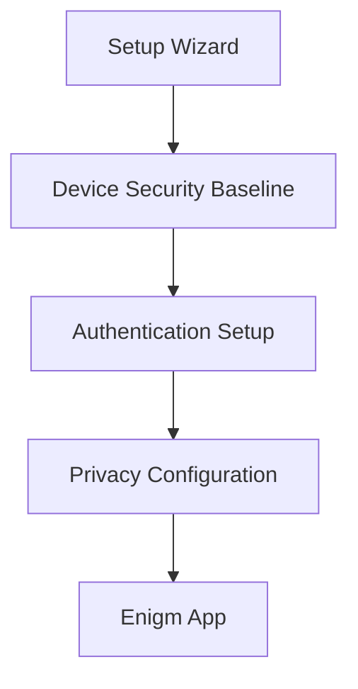

The Enigm OS Setup Wizard is the initial device provisioning and trust-establishment workflow. It is designed to establish a secure device baseline before the device enters normal operation.

The Setup Wizard focuses on Enigm platform functionality, device security, privacy choices, network readiness, and transition into Enigm App. It is not a general-purpose consumer onboarding flow.

This document is intended for Android engineers, security auditors, enterprise customers, and technical partners.

## Overview

The Setup Wizard guides the user through first-use configuration and prepares the device for secure operation within the Enigm ecosystem.

The workflow establishes:

- Initial device setup.
- Security baseline.
- Network configuration.
- Strong authentication.
- Device personalization.
- Privacy choices.
- Transition into Enigm App.

## Design Objectives

The Setup Wizard is designed to:

- Establish a secure baseline before normal device operation.
- Require security-relevant setup steps before the user enters the main experience.
- Reduce unnecessary setup surfaces.
- Prioritize Enigm platform functionality.
- Configure network access needed for supported workflows.
- Require strong local authentication.
- Introduce privacy controls clearly.
- Transition the user directly into Enigm App.

The Setup Wizard should avoid unnecessary data collection and should present security-relevant decisions in a way that can be reviewed by users, administrators, and auditors.

## Provisioning Flow

The intended onboarding flow is:

1. Welcome.
2. Language and Region.
3. Mobile Connectivity.
4. Secure Wi-Fi.
5. Date and Time.
6. Appearance.
7. Strong PIN Setup.
8. Optional Biometric Enrollment.
9. Privacy Mode Introduction.
10. Terms and Privacy.
11. Launch Enigm App.

The flow is intended to complete required device setup, establish the baseline security posture, and move the user into the Enigm experience without unnecessary intermediate surfaces.

## Security Baseline

The Setup Wizard is intended to establish a secure baseline before normal operation.

The baseline includes:

- Required authentication configuration.
- Initial network readiness.
- Privacy control introduction.
- Device personalization.
- Required user acknowledgements.
- Transition into Enigm App.

Security baseline establishment should fail closed when required security conditions are not completed. A device should only be treated as ready for normal use after required setup steps have completed.

## Authentication Setup

The Setup Wizard is designed to require strong device authentication before normal operation.

### Strong PIN Policy

Strong PIN setup is a required security control for Enigm OS onboarding.

The policy is defined conceptually around:

- Minimum security requirements.
- Weak credential prevention.
- Authentication-first design.
- Protection of local device access.
- Support for secure device workflows.

Weak credentials should be rejected where they do not meet the required security baseline. The goal is to reduce risk from trivial local access attempts and strengthen the Device Trust model before Enigm App usage begins.

### Optional Biometric Enrollment

Biometric enrollment may be offered as an optional convenience and access-control layer after strong PIN setup.

Biometrics should not replace the requirement for strong device authentication. They should operate as an additional local unlock method when configured by the user and available on the device.

## Privacy Controls

The Setup Wizard introduces privacy controls as part of first-use configuration.

### Privacy Mode

Privacy Mode is introduced as a device protection feature. It is intended to help users understand that Enigm OS includes device-level privacy controls that may affect device behavior, exposure, and security posture.

The Setup Wizard should explain Privacy Mode at a user-facing level without exposing enforcement mechanics or policy internals.

Privacy choices should be presented clearly and should avoid implying that any single privacy setting provides complete protection.

## Network Configuration

The Setup Wizard prepares the device for supported Enigm workflows by configuring network access.

Network setup may include:

- Mobile connectivity.
- Secure Wi-Fi.
- Date and time readiness for trust-sensitive operations.

Network configuration is necessary for supported services, update checks, account workflows, and Enigm App transition.

Network setup does not replace Enigm App end-to-end encryption, protected key material, or user trust decisions.

## User Experience Principles

The setup experience is intentionally reduced and focused on Enigm platform functionality.

User experience principles include:

- Keep setup focused on required security and platform readiness.
- Avoid unnecessary account ecosystems.
- Avoid unnecessary external service prompts.
- Present security choices before normal operation.
- Use clear language for authentication and privacy decisions.
- Avoid overstating security assurances.
- Transition directly into Enigm App after setup completion.

### External Services

The setup experience is intentionally limited to the workflows required for Enigm OS and Enigm platform use.

It should avoid dependency on broad third-party account ecosystems during the initial provisioning path. The purpose is to establish a controlled device baseline and move the user into the Enigm experience.

## Relationship With Enigm App

Enigm is the primary user-facing private messaging product in the Enigm ecosystem.

The Setup Wizard is intended to finalize device readiness and launch Enigm App as the first normal operating experience. This transition aligns device security baseline, authentication setup, privacy choices, and network readiness with Enigm App account, device association, messaging, and call workflows.

The Setup Wizard does not replace Enigm App security controls. Enigm App secure messaging and secure calls continue to rely on app-level cryptography, protected key material, trusted device association, and verification workflows.

### Finalization

Finalization should transition users directly into the Enigm experience.

After required setup steps are complete, the user should enter Enigm App rather than a broad general-purpose onboarding environment. This supports a controlled device experience and reduces unnecessary exposure before Enigm platform workflows begin.

## Security Limitations

The Setup Wizard establishes an initial security baseline, but it does not eliminate device or user risk.

Limitations include:

- It cannot prevent all unsafe user decisions after setup.
- It does not replace Enigm App end-to-end encryption.
- It does not replace Trust Security Center posture evaluation.
- It does not replace OTA verification or device lifecycle controls.
- It does not ensure that future device state remains trusted.
- It does not protect against social engineering.
- It does not provide assurance for systems outside Enigm control.
- It does not make weak operational practices safe.

The Setup Wizard should be understood as the first step in Enigm OS trust establishment, followed by ongoing device posture evaluation, policy enforcement, update verification, and Enigm App security workflows.
