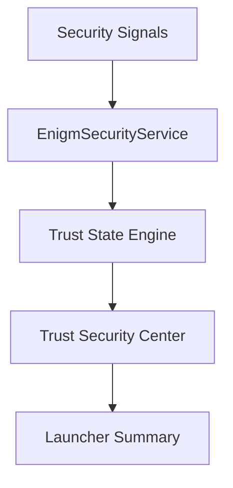

Trust Security Center is the local Device Trust evaluation system for Enigm OS. It evaluates device security signals, determines a trust state, presents findings to the user, and exposes summarized posture for device workflows.

Trust Security Center is not an antivirus. It is not a numeric security score, a percentage-based rating, or a general-purpose threat scanner. It is a Device Trust surface for Enigm OS.

## Overview

Trust Security Center evaluates multiple independent device integrity and security signals to determine whether the local device is operating in an expected trust state.

The system uses three internal trust outcomes:

- `PROTECTED`
- `REVIEW_REQUIRED`
- `INACTIVE`

The corresponding user-visible states are:

- Protected
- Review Required
- Inactive

Trust Security Center does not inspect message content, call content, attachments, documents, or user conversations. It operates on device security signals rather than user content.

## Design Objectives

Trust Security Center is designed to:

- Provide a clear local Device Trust state.
- Surface security findings that require user or administrator attention.
- Support Enigm OS posture visibility.
- Support launcher-level trust summaries.
- Support managed device workflows where enabled.
- Keep device posture separate from message confidentiality.
- Avoid numeric scores, percentages, or ratings.
- Avoid exposing sensitive detection logic in public documentation.

## Architecture

Trust Security Center is built around local device security signal evaluation.

Conceptually:

- `EnigmSecurityService` collects and normalizes local security signals.
- Trust State Engine evaluates the normalized security posture.
- Trust Security Center presents the Device Trust state and findings.
- Launcher Summary displays a concise device protection state.

The architecture is local-device oriented. It does not provide message plaintext access and does not operate as a content inspection system.

## Trust Evaluation Model

Trust evaluation is based on multiple independent signals rather than a single indicator.

Examples of evaluated signal categories include:

- Device integrity.
- Verified software state.
- Security policy compliance.
- Protected network state.
- Device management state.
- Security service status.

Trust Security Center is designed to identify whether critical Enigm OS protections are active, degraded, unavailable, or not currently measurable.

Trust Security Center is expected to represent real device state. It must not hide degraded boot, software, update, policy, or security-service conditions to make a device appear protected. A warning should clear only when the underlying condition is resolved or no longer relevant according to the documented trust model.

Trust evaluation must remain separate from Enigm App message confidentiality. A Device Trust state may inform device workflows, but it does not grant administrative access to encrypted content.

## Trust States

Trust Security Center defines three official trust outcomes.

### Protected

Internal state: `PROTECTED`

User-visible state: Protected

Protected means all critical Enigm OS protections are active and operating as expected.

User-facing example:

> All critical Enigm OS protections are operating normally.

Launcher integration:

- Protected -> Device Protected

### Review Required

Internal state: `REVIEW_REQUIRED`

User-visible state: Review Required

Review Required means one or more critical protections are degraded, unavailable, or require user attention.

User-facing example:

> One or more critical protections require attention.

Launcher integration:

- Review Required -> Device At Risk

### Inactive

Internal state: `INACTIVE`

User-visible state: Inactive

Inactive means Trust Security Center cannot reliably determine device integrity because critical trust services are unavailable.

User-facing example:

> Trust cannot currently evaluate device integrity.

Launcher integration:

- Inactive -> Protection Inactive

## Security Findings

Trust Security Center findings explain why the device is in a given trust state and what action may be required.

Each finding should contain:

- Severity.
- Description.
- Recommendation.
- Source.

Supported severities are:

- Info.
- Low.
- Medium.
- High.
- Critical.

Finding severity is used to communicate security relevance. It is not a numeric score, percentage, or rating.

## User Guidance

Guidance should:

- Describe the issue in user-understandable terms.
- Explain why attention may be required.
- Recommend a safe next action.
- Avoid revealing sensitive rule behavior.
- Avoid implying that a state assurances complete protection.

Examples:

- A Protected device can still be affected by unsafe user decisions or vulnerable external systems.
- A Review Required device needs attention before it should be treated as fully trusted for sensitive workflows.
- An Inactive device should not be treated as trusted until trust services are restored.

## Relationship With Enigm OS

Trust Security Center is a core Enigm OS security surface.

It evaluates device posture, presents trust state, and supports local visibility into security-relevant device state. It works with Enigm OS security services, policy enforcement, network controls, device management state, and update trust signals.

Trust Security Center does not replace Enigm OS hardening. It reports and explains trust state; Enigm OS provides the underlying platform controls.

## Relationship With Enigm App

Enigm App remains the primary user-facing product for secure messaging, secure calls, account workflows, and user interaction.

Trust Security Center provides device posture information that informs Enigm App trust decisions when Enigm OS is deployed. For example, Device Trust state may inform whether a device should be considered eligible for sensitive workflows.

Trust Security Center does not inspect:

- Message content.
- Media content.
- Call content.
- Attachments.
- Documents.
- User conversations.

Trust operates on device security signals rather than user content.

## Relationship With Device Management

Trust Security Center can support managed device workflows where the user or organization enables managed device capabilities.

Relevant integrations may include:

- Device enrollment state.
- Device management state.
- Policy compliance state.
- Security service state.
- Device posture reporting.
- Remote wipe readiness where enabled.

Device management visibility is not message visibility. Managed device workflows must not bypass Enigm App end-to-end encryption or provide administrative access to message plaintext.

## Privacy Model

Trust Security Center is designed around device posture evaluation, not content inspection.

Privacy principles include:

- Evaluate device security signals rather than user content.
- Avoid unnecessary exposure of identity metadata.
- Keep message, media, call, attachment, document, and conversation content outside the trust evaluation model.
- Share posture information only where required for supported device or account workflows.

Trust Security Center exposes high-level posture summaries to Enigm ecosystem components such as Enigm Command or managed device workflows. Such summaries should be limited to security state and should not include user content.

See [Platform Limitations](/legal/limitations).
