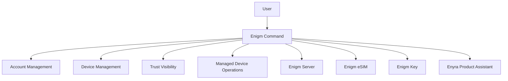

Enigm Command is the web control panel product in the Enigm ecosystem. It is the administrative and account-management surface responsible for account lifecycle, device lifecycle, security configuration, trust visibility, private environment management, Enigm eSIM management, Enigm Key configuration, and managed device operations.

The Enigm Command is not a messaging client. It must not provide access to message plaintext, secure call content, private key material, decrypted attachments, or implementation-sensitive communication state.

This document is intended for security auditors, enterprise customers, technical partners, and security engineers. It describes the public Enigm Command architecture without exposing non-public interfaces, deployment data stores, infrastructure names, storage systems, non-public routes, sensitive values, private response methods, or implementation-sensitive details.

## Overview

The Enigm Command provides administrative workflows for managing Enigm accounts, trusted devices, sessions, security configuration, managed device capabilities, Enigm Server, Enigm eSIM, Enigm Key emergency contacts, Active Defense review context, and security event visibility.

The Enigm Command supports administrative visibility into security state, but security state visibility is not equivalent to message visibility.

The Enigm Command may also expose Enyra Product Assistant capabilities for product guidance, user assistance, documentation guidance, configuration assistance, platform navigation, feature explanation, device assistance, and account assistance. This product-assistance mode is separate from Enyra security operations assistance in the Intelligence section.

## Account Management

Account management supports account lifecycle and account security workflows.

Enigm Command account workflows may include:

- Account status review.
- Account lifecycle state review.
- Account recovery support boundaries.
- Account policy assignment.
- Visibility and access configuration.
- Account deletion workflows.
- Data deletion workflows where supported.
- Session review.
- Security event review related to account activity.

Account recovery support must not weaken normal message confidentiality. Recovery support may help restore account access or support device replacement, but it must not provide administrative access to message plaintext.

## Device Management

Device management supports explicit device lifecycle control.

Enigm Command device workflows may include:

- Device inventory review.
- Connected-device visibility.
- Trusted device visibility.
- Device enrollment review.
- Device revocation.
- Removal of unauthorized devices.
- Device replacement.
- Device security reporting.
- Managed device capability review.
- Trust status review.
- Active Defense finding review where authorized.

Device management and message access are separate trust domains. Administrative device actions may affect future trust decisions, but they must not decrypt messages or expose private key material.

## Trusted Device Lifecycle

Trusted device lifecycle controls help administrators and authorized users reason about which devices can participate in protected workflows.

Lifecycle states may include:

- Pending enrollment.
- Trusted.
- Restricted.
- Revoked.
- Replaced.
- Retired.

Device revocation should immediately affect future trust decisions. A revoked device should not continue receiving newly protected content according to lifecycle policy.

Device replacement should be treated as a new trust event rather than a silent continuation of the replaced device.

## Session Management

Session management supports visibility and control over active or recent account sessions.

Session workflows may include:

- Active session review.
- Session restriction.
- Session termination.
- Closing active sessions from devices no longer trusted by the user.
- Session-related security event visibility.
- Policy updates that affect session eligibility.

Session management does not provide access to message plaintext or secure call content.

## Managed Devices

Managed device capabilities are optional device-management features enabled for deployments or users that choose managed device operation.

Managed device capabilities may provide:

- Additional device status signals.
- Managed device policy enforcement.
- Device security reporting.
- Device lifecycle operations.
- Remote device management features where enabled.
- Additional Trust state visibility.

Managed device capabilities should remain separate from message confidentiality controls.

## Remote Wipe

Remote wipe capabilities are available only for enrolled managed devices where managed device operation is enabled.

Remote wipe is a device lifecycle and risk-reduction capability. It is not a mechanism for accessing message plaintext.

Remote wipe workflows should be authorized, auditable, and scoped to managed device policy. The exact effects of remote wipe depend on device state, connectivity, supported platform behavior, and managed device configuration.

## Enigm Server Management

Enigm Command may support creation and administration of Enigm Server where private environment capabilities are enabled.

Server management workflows may include:

- Creating private environments.
- Managing environment membership.
- Configuring visibility and access rules.
- Reviewing connected devices for the environment where authorized.
- Removing unauthorized participants or devices.
- Reviewing environment security events.
- Managing environment lifecycle and deletion workflows.

Enigm Server management must preserve the separation between administrative control and protected communication confidentiality.

## Enigm eSIM Management

Enigm Command may support Enigm eSIM lifecycle workflows where enabled.

Enigm eSIM management workflows may include:

- Reviewing Enigm eSIM status.
- Managing activation lifecycle.
- Reviewing device association.
- Applying policy where managed configuration exists.
- Supporting replacement or retirement workflows.

Enigm eSIM state is connectivity state. It does not provide access to message plaintext, call content, media content, attachments, or private key material.

## Enigm Key Management

Enigm Command may support Enigm Key management where the user or deployment enables emergency-device workflows.

Enigm Key workflows may include:

- Associated Enigm Key visibility.
- Emergency contact configuration.
- Emergency contact lifecycle review.
- Device loss handling.
- Device revocation.
- Device replacement.
- Emergency event visibility where authorized.

Enigm Key emergency contact configuration should remain explicit and user-controlled. Emergency workflows must remain separate from normal message and call content.

## Trust Status Integration

The Enigm Command may display Trust status signals from Enigm App, Active Defense findings, device lifecycle state, optional managed device capabilities, and optional Enigm OS posture.

Trust status may include:

- Device enrollment state.
- Device revocation state.
- Device replacement state.
- Managed device state.
- Enigm Server policy state where applicable.
- Enigm eSIM lifecycle state where applicable.
- Enigm Key lifecycle state where applicable.
- Security event visibility.
- Active Defense review context.
- Optional Trust Security Center posture.
- Optional Remote Attestation outcome where applicable.

Trust status is intended to support administrative review and decision-making. It does not provide access to protected message content.

## Enyra Product Assistant

Enyra Product Assistant in the Enigm Command supports product and administrative guidance.

It may help authorized users with:

- Product guidance.
- User assistance.
- Documentation guidance.
- Configuration assistance.
- Platform navigation.
- Feature explanation.
- Device assistance.
- Account assistance.
- Managed device capability explanation.
- Enigm Command workflow orientation.

Product assistance should use product knowledge, documentation, configuration guidance, and user-facing support context. It should not require access to threat intelligence, security telemetry, protected message content, secure call content, or private key material.

If a request moves into security investigation, threat intelligence access, risk analysis, or defensive operations support, it belongs to Enyra Security Analyst workflows documented under Intelligence.

## Security Boundaries

The Enigm Command has explicit security boundaries:

- The Enigm Command does not provide access to message plaintext.
- Administrative capabilities do not bypass end-to-end encryption.
- Device management and message access are separate trust domains.
- Security state visibility is not equivalent to message visibility.
- Enigm Command actions must not expose private key material.
- Enigm Command workflows must not expose decrypted attachments or secure call content.
- Product assistance must not expand access beyond the user's authorized Enigm Command role.

Administrative workflows should be authenticated, authorized, scoped, and auditable.

## Privacy Considerations

The Enigm Command should expose only the information required for administrative review, device lifecycle control, policy management, and security event visibility.

Privacy considerations include:

- Use privacy-preserving device identifiers where possible.
- Avoid exposing unnecessary identity metadata.
- Separate account state from message content.
- Separate device lifecycle state from message plaintext.
- Minimize security event metadata to what is required for review and audit.
- Limit Active Defense finding visibility to authorized review contexts.
- Avoid exposing protected content in administrative views.

## Security Limitations

The Enigm Command provides administrative control and visibility, but it does not eliminate endpoint or user risk.

Important limitations:

- Administrative visibility does not prove that an endpoint is free of compromise.
- Active Defense findings improve review context but do not guarantee detection of every malware or spyware risk.
- Remote wipe may depend on device state, connectivity, and managed device support.
- Device revocation affects future trust decisions but cannot guarantee removal of content already accessed by an authorized device.
- Account recovery support must not be treated as protected content access.
- Incorrect policy configuration can affect account, device, or session behavior.
- Optional Enigm OS posture can strengthen device review where deployed, but Enigm Command architecture must remain valid without requiring Enigm OS.

## Threat Model References

Relevant threat-model areas include Enigm Command abuse, account and app compromise, device lifecycle abuse, Enigm OS policy bypass where deployed, managed device misuse, and loss of audit visibility.
