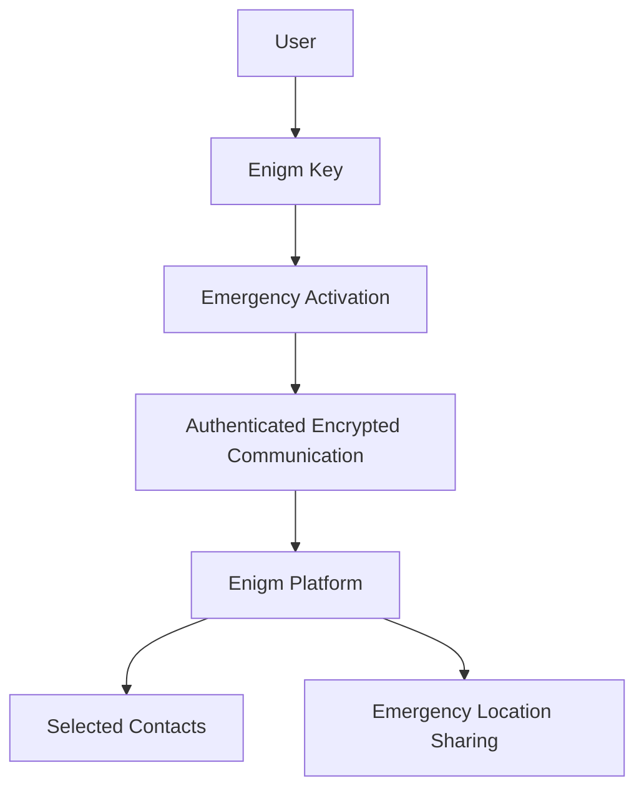

Enigm Key is the emergency key device in the Enigm ecosystem. It is designed to help a user trigger an SOS alert from a dedicated physical device without requiring phone unlock or direct app interaction at the moment of activation.

Enigm Key is a supporting platform component. It does not replace Enigm App, secure messaging, secure calls, device trust, or user account security. It is designed to integrate with an Enigm account and communicate securely with the Enigm platform when an emergency workflow is activated.

This document is intended for security auditors, enterprise customers, technical partners, security engineers, and product integrators.

## Overview

Enigm Key is a compact emergency device with embedded mobile data connectivity. It is intended for scenarios where a user may need to notify selected trusted contacts quickly and discreetly.

When activated, Enigm Key is designed to:

- Send an emergency alert.
- Notify user-selected contacts inside the Enigm platform.
- Share the user's location during the active emergency workflow.
- Authenticate device communication.
- Protect communication with encrypted and signed requests.
- Remain dormant during normal non-emergency operation to support user privacy.

The diagram is conceptual and describes the emergency alert flow at a public architecture level.

## Design Objectives

Enigm Key is designed to support:

- Emergency alerting from a dedicated physical device.
- Privacy-preserving standby behavior.
- Secure account association.
- Authenticated device communication.
- Encrypted platform synchronization.
- User-selected emergency contacts.
- Event-bound location sharing during emergencies.
- Minimal routine data exposure.

The objective is to provide emergency communication capability while preserving Enigm's privacy-first design principles.

## Emergency Activation Model

Enigm Key is activated through a deliberate physical interaction.

The intended activation model is:

- The user presses the device button three times.
- The device exits dormant state for the emergency workflow.
- The device authenticates with the Enigm platform.
- The platform triggers alerts for the user's selected emergency contacts.
- Location sharing begins for the active emergency event.

The activation model is designed to reduce accidental operation while remaining simple enough for high-stress situations.

## Connectivity Model

Enigm Key includes embedded mobile data connectivity designed to support emergency communication when the user's phone may be unavailable, locked, or unsafe to operate.

Connectivity is a transport capability. It does not replace account security, device authentication, encrypted communication, or user-controlled emergency contact configuration.

The connectivity layer should be treated as separate from Enigm App secure messaging and secure calls.

## Account Association

Enigm Key is associated with a user's Enigm account through an explicit synchronization workflow.

Account association is intended to:

- Bind the device to an authorized Enigm account.
- Allow the user to configure emergency contacts.
- Support device lifecycle review.
- Support revocation or replacement if the device is lost or retired.

Account association should use privacy-preserving identifiers where possible. The device should not rely on unnecessary public identifiers for normal platform operation.

## Emergency Contact Workflow

The user can configure which trusted contacts should receive emergency alerts.

When the emergency workflow is activated, selected contacts may receive:

- Emergency alert state.
- User identity context required for the alert.
- Location updates during the active emergency event.
- Event status where supported.

Emergency contact workflows should be explicit and user-controlled. Administrative systems should not convert emergency contact visibility into broad access to user communications.

Emergency contact lifecycle management may include:

- Adding trusted emergency contacts.
- Reviewing configured contacts.
- Removing contacts.
- Replacing contacts.
- Reviewing emergency contact eligibility.
- Retiring emergency contact access when no longer required.

Emergency contacts receive only the emergency context required for the active workflow. Emergency contact configuration should not expose normal messages, secure calls, media, attachments, or user conversations.

## Location Sharing

Enigm Key is designed to share location during an active emergency workflow.

Location sharing should be:

- Event-bound.
- Limited to selected contacts or authorized emergency workflows.
- Protected in transit.
- Stopped or retired according to the emergency event lifecycle.
- Separated from routine standby behavior.

When Enigm Key is not activated, it is intended to remain dormant and avoid routine location reporting. This supports privacy and data minimization.

## Device Sleep And Privacy

Enigm Key is designed around dormant standby behavior.

During normal non-emergency operation, the device is intended to remain in a low-activity state. This reduces unnecessary network activity, location exposure, and battery usage.

Privacy principles include:

- No routine emergency-location sharing while inactive.
- Event-bound data transmission.
- Minimal standby communication.
- Purpose-limited emergency data.
- Account association using privacy-preserving identifiers where possible.
- Separation between emergency alerts and message content.

Enigm Key should be documented as privacy-oriented emergency hardware, not as a continuous tracking device.

## Authentication And Request Integrity

Enigm Key communication is designed to be authenticated and protected.

The device uses a unique per-device HMAC credential for platform authentication. Requests are signed so the platform can verify that communication is associated with an authorized device.

The security model is intended to support:

- Device authentication.
- Request integrity.
- Encrypted communication.
- Rejection of unauthenticated device traffic.
- Account-bound device association.

Public documentation describes this authentication model at a high level suitable for external review.

## Relationship With Enigm App

Enigm App remains the primary user-facing product in the Enigm ecosystem.

Enigm App may support:

- Enigm Key account association.
- Emergency contact configuration.
- Emergency event visibility.
- Device lifecycle review.
- Revocation or replacement workflows.
- Device loss handling.
- Emergency contact lifecycle management.

Enigm Key does not replace Enigm App secure messaging, secure calls, protected key material, or trusted device workflows.

## Relationship With Enigm Command

Enigm Command may support administrative or account-management visibility for Enigm Key where appropriate.

Enigm Command workflows may include:

- Associated device visibility.
- Emergency contact review where authorized.
- Device lifecycle actions.
- Revocation or replacement state.
- Device loss handling.
- Emergency contact lifecycle management.
- Security event visibility.

Enigm Command visibility must remain separate from message plaintext, secure call content, media content, attachments, and user conversations.

## Security Limitations

Enigm Key reduces emergency communication friction, but it does not eliminate all personal safety, connectivity, or device security risk.

Limitations include:

- Emergency delivery may depend on available mobile connectivity.
- Location availability may depend on device state and environmental conditions.
- Physical possession of the device remains security-relevant.
- Device loss should be handled through revocation or replacement workflows.
- Enigm Key does not replace emergency services.
- Enigm Key does not replace Enigm App end-to-end encryption.
- Enigm Key does not make compromised endpoints trustworthy.
- User-selected contacts may disclose information they receive.

Enigm Key should be evaluated as a privacy-oriented emergency alerting device within the broader Enigm ecosystem.
