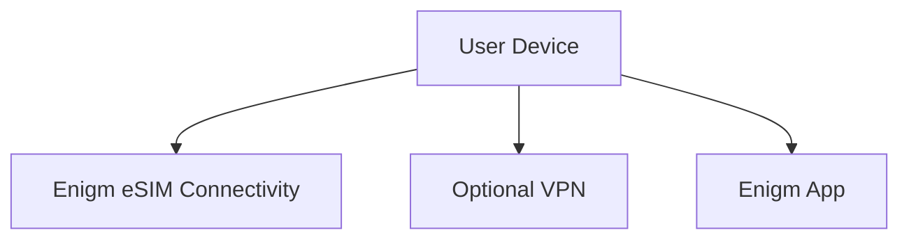

Enigm eSIM is the private connectivity product in the Enigm ecosystem. It is focused on privacy-oriented mobile data connectivity and can be combined with other Enigm privacy and security controls.

This document is intended for security auditors, enterprise customers, technical partners, and security engineers. It describes the public Enigm eSIM architecture without exposing third-party relationships, connectivity partner details, infrastructure relationships, commercial arrangements, activation backends, operational procedures, or implementation-sensitive details.

## Overview

The Enigm eSIM service provides mobile data connectivity as a supporting platform component. It is separate from Enigm App cryptography, separate from end-to-end encryption, and separate from VPN functionality.

Mobile connectivity and message confidentiality are different security problems. Enigm eSIM connectivity can affect how a device reaches networks, but it does not define how message content is encrypted or how devices are trusted for secure messaging.

## Purpose

The Enigm eSIM service is designed to reduce dependence on traditional mobile identity workflows where possible while providing mobile data connectivity.

The Enigm eSIM may help mitigate:

- Certain mobile identity exposure scenarios.
- Dependence on traditional subscriber workflows.
- Some forms of network visibility.

The Enigm eSIM service does not replace secure messaging, end-to-end encryption, device trust, VPN transport protection, or account security controls.

## Mobile Data Connectivity

The Enigm eSIM service provides mobile data connectivity for supported devices and deployments.

Mobile data connectivity may support:

- Network access for Enigm App.
- Network access for optional VPN usage.
- Network access for other supported Enigm platform components.
- Policy-aware connectivity behavior where managed configuration applies.

Connectivity behavior should be understood as a transport and access capability, not as a message confidentiality mechanism.

## Lifecycle Management

Enigm eSIM lifecycle management may be available through Enigm App or Enigm Command where enabled.

Lifecycle workflows may include:

- Activation state review.
- Device association review.
- Replacement or retirement.
- Policy assignment where managed configuration applies.
- Connectivity status visibility.
- Support workflows for eligible devices.

Lifecycle visibility should remain focused on connectivity and policy state. It must not become a message, call, media, attachment, or conversation visibility surface.

## Relationship With Enigm App

Enigm App remains responsible for app-level security functions such as secure messaging, secure calls, key management, device association, verification workflows, and message expiration.

The Enigm eSIM service is separate from Enigm App cryptography. It does not replace protected key material, secure device storage, end-to-end encryption, or device trust decisions.

Enigm App should remain secure according to its app-level model whether Enigm eSIM connectivity is used or not.

## Relationship With VPN

The Enigm eSIM service is separate from VPN functionality.

Enigm eSIM provides mobile data connectivity. VPN provides an optional transport privacy layer where enabled. These components can be combined, but they address different parts of the security model.

Using Enigm eSIM does not imply VPN protection. Using VPN does not change the need to evaluate device trust, application-layer encryption, and message confidentiality separately.

## Relationship With Enigm Command

Enigm Command may provide Enigm eSIM management where enabled.

Enigm Command workflows may include:

- Reviewing Enigm eSIM status.
- Managing activation lifecycle.
- Reviewing associated device state.
- Applying managed connectivity policy.
- Supporting replacement or retirement workflows.

Administrative Enigm eSIM management must remain separate from protected communication content and private key material.

## Privacy Considerations

The Enigm eSIM service can support privacy objectives by reducing dependence on traditional mobile identity workflows where possible.

Privacy considerations include:

- Limit exposure of mobile connectivity lifecycle data.
- Avoid exposing unnecessary identity metadata.
- Separate connectivity state from message content.
- Keep administrative visibility focused on lifecycle and policy state.
- Avoid treating connectivity status as proof of message activity.

The Enigm eSIM service should be documented as a connectivity layer, not as an identity-erasure mechanism.

## Metadata Considerations

Mobile connectivity requires some metadata to function. The Enigm eSIM service should minimize metadata collection and exposure where possible.

Metadata may relate to:

- Connectivity state.
- Activation or deactivation lifecycle.
- Device eligibility.
- Policy state.
- Support and audit lifecycle events.

Metadata related to connectivity should remain separate from secure messaging content, secure call content, private key material, and protected attachments.

## Security Limitations

The Enigm eSIM service does not mitigate:

- Device compromise.
- Malware with sufficient privileges.
- Message disclosure by trusted participants.
- Social engineering.
- Endpoint compromise.
- Weak device trust.
- Incorrect policy configuration.
- Plaintext exposure after authorized local decryption.

The Enigm eSIM service does not replace secure messaging, end-to-end encryption, VPN protection, device trust, account security, or verification workflows.

## Threat Model Considerations

The Enigm eSIM service is relevant to mobile connectivity, mobile identity exposure, network visibility, and transport access scenarios.

Relevant threat-model areas include network-policy misuse, account and app compromise, device lifecycle abuse, secure messaging compromise attempts, secure call compromise attempts, and loss of audit visibility.

Public documentation must not expose third-party connectivity relationships, commercial arrangements, activation backends, deployment topology, or implementation-sensitive behavior.
