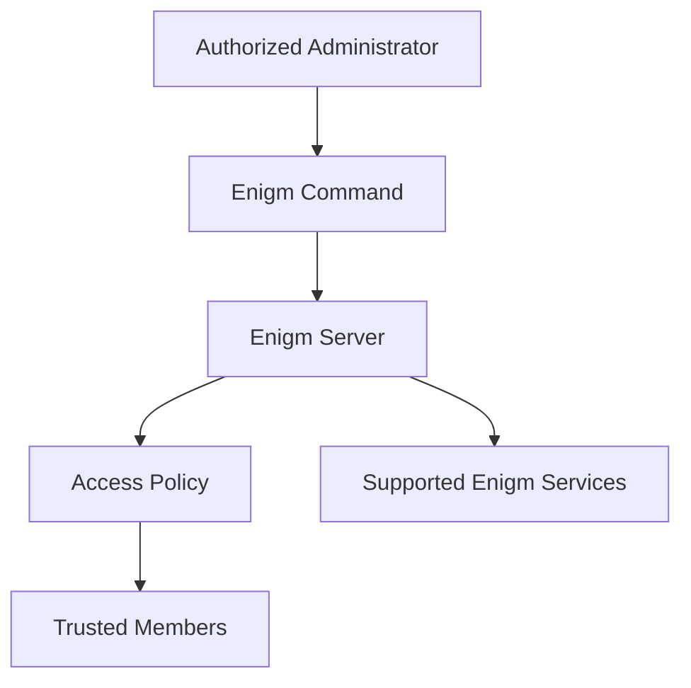

Enigm Server is the dedicated private server product in the Enigm ecosystem. It is designed for users, organizations, and deployments that require administrative control, reduced exposure, dedicated policy boundaries, and controlled access to Enigm platform capabilities.

Enigm Server does not replace Enigm private messaging, end-to-end encryption, device trust, or user trust decisions. It provides an administrative and platform boundary for operating selected Enigm services under dedicated policies.

## Overview

Enigm Server supports the creation and administration of private environments for supported Enigm workflows.

Private environments may be used to:

- Separate organizational or group activity from broader platform contexts.
- Apply dedicated access policies.
- Manage trusted participants.
- Control visibility of environment-level resources.
- Support private operational boundaries for communities, teams, or enterprise deployments.
- Reduce unnecessary exposure of environment membership and activity metadata.

## Design Objectives

Enigm Server is designed to support:

- Private environment administration.
- Dedicated access control.
- Reduced public exposure.
- Environment-level policy management.
- Separation between administrative control and protected content.
- Privacy-preserving participant and device handling where possible.
- Controlled lifecycle management through Enigm Command.

The objective is to provide a private administrative boundary, not to create a bypass around Enigm App security controls.

## Private Environment Model

A private environment is a controlled platform context with its own membership, policy, and administrative lifecycle.

At a public architecture level, private environments may include:

- Environment identity.
- Authorized administrators.
- Member lifecycle.
- Device eligibility policy.
- Access visibility rules.
- Supported communication or collaboration surfaces.
- Security event visibility.
- Policy state.

Private environment data should be minimized and scoped to the purpose of the environment.

## Administrative Control

Enigm Command is the administrative surface for Enigm Server where private environment management is enabled.

Administrative workflows may include:

- Creating private environments.
- Reviewing environment membership.
- Managing access policies.
- Reviewing connected devices where authorized.
- Restricting or removing unauthorized participants.
- Configuring visibility and access rules.
- Reviewing security events.
- Managing lifecycle state.

Administrative control does not provide access to message plaintext, call content, media content, attachments, or private key material.

## Access Policy

Private environment access should be policy-governed.

Policy may consider:

- Account eligibility.
- Device trust.
- Session state.
- Member role.
- Managed-device state where enabled.
- Optional Enigm OS posture where deployed.
- Security findings where authorized.

Access decisions should be documented at the category level and should not expose private detection logic, internal routes, operational controls, or infrastructure topology.

## Privacy Model

Enigm Server follows the Enigm privacy-first model.

Privacy considerations include:

- Minimize environment membership exposure.
- Use privacy-preserving identifiers where possible.
- Separate environment metadata from protected content.
- Limit administrative visibility to required lifecycle and policy context.
- Avoid treating environment activity as proof of message or call content.
- Retain environment records only for defined operational, security, legal, or compliance purposes.

Private environments should reduce unnecessary exposure, not increase routine data collection.

## Relationship With Enigm

Enigm remains the primary user-facing private messaging product.

Users may access supported private environment workflows through the Enigm app when authorized by account, device, and environment policy.

Enigm security controls remain applicable:

- End-to-end encryption.
- Protected key material.
- Device association.
- Message expiration.
- Secure call establishment.
- Multi-device trust.
- Verification workflows.

Private environment membership does not automatically grant message or call plaintext access.

## Relationship With Enigm Command

Enigm Command provides environment administration and review workflows.

It may support:

- Environment creation.
- Membership administration.
- Access configuration.
- Connected-device visibility.
- Session review.
- Device removal.
- Data deletion workflows.
- Account or environment closure workflows.
- Enigm eSIM, Enigm Key, and managed-device lifecycle visibility where enabled.

The Enigm Command must preserve the separation between administrative lifecycle management and protected communication confidentiality.

## Relationship With Enigm Intelligence

Enigm Intelligence may process minimized security signals related to private environment security where authorized and policy-permitted.

Examples include:

- Access anomalies.
- Device lifecycle events.
- Policy violations.
- Suspicious activity indicators.
- Defensive response outcomes.

Security visibility should support risk reduction without exposing protected content or unnecessary identity metadata.

## Security Considerations

- Private environment access should require explicit authorization.
- Administrative roles should be scoped and auditable.
- Device trust should remain separate from account trust.
- Policy changes should affect future eligibility according to lifecycle rules.
- Administrative actions must not bypass end-to-end encryption.
- Connected-device visibility should use minimized identifiers where possible.
- Environment deletion or data deletion workflows must preserve legal, security, and operational boundaries where applicable.

## Security Limitations

Enigm Server reduces exposure and provides dedicated administrative boundaries, but it does not eliminate all risk.

Important limitations:

- Authorized members may disclose information they receive.
- Compromised endpoints may expose content after authorized local access.
- Misconfigured policy can affect access behavior.
- Private environment membership may still require limited metadata.
- Administrative removal affects future access but cannot guarantee removal of content already accessed by an authorized participant.
- Private environments do not replace end-to-end encryption, device trust, secure onboarding, or user security awareness.

## Threat Model References

Relevant threat-model areas include private environment abuse, account compromise, device lifecycle abuse, Enigm Command abuse, metadata exposure, malicious trusted users, endpoint compromise, and loss of administrative audit visibility.
