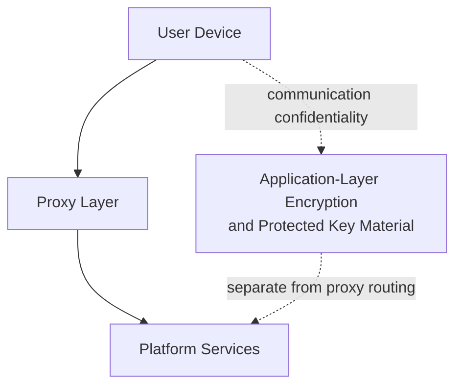

The Enigm proxy network is a privacy and traffic-separation layer within the Enigm ecosystem. It exists to reduce direct exposure between client devices and platform services while preserving application-layer security controls.

This document is intended for security auditors, enterprise customers, technical partners, and security engineers. It describes the public proxy-network architecture without exposing non-public path structure, deployment scale, infrastructure labels, geographic deployment information, private network design, or operational details.

## Overview

The proxy network is separate from end-to-end encryption and separate from the optional VPN layer.

The proxy layer provides an additional privacy boundary between user devices and platform services. It can help reduce direct network exposure, lower confidence in simple traffic correlation, and support traffic-separation objectives according to platform policy.

Communication confidentiality remains dependent on application-layer encryption and protected key material. The proxy layer is not intended to replace encryption.

## Purpose

The proxy network is designed to:

- Reduce direct exposure between client devices and platform services.
- Provide an additional privacy boundary.
- Support traffic separation according to platform policy.
- Contribute to metadata reduction objectives.
- Increase difficulty for simple timing-based traffic correlation methods.
- Support policy-controlled network mediation without becoming a plaintext content access layer.

The proxy layer is not intended to replace device trust, endpoint security, secure messaging encryption, secure call session security, or user trust decisions.

## Traffic Separation

Traffic separation reduces direct association between a client device and platform services at the network path level.

Traffic routing decisions are performed according to platform policy. Public documentation does not disclose non-public path structure, path-selection behavior, infrastructure layout, or operational procedures.

Traffic separation can help reduce direct visibility, but it does not remove the need for:

- Application-layer encryption.
- Protected key material.
- Device trust.
- Account authorization.
- Message expiration and lifecycle controls.
- Verification workflows.

## Metadata Reduction

The proxy network contributes to metadata reduction and traffic separation objectives.

Metadata reduction may include reducing direct exposure of:

- Client-to-service network relationships.
- Simple request timing patterns.
- Direct service access patterns.
- Some network-layer context visible to intermediate observers.

Metadata reduction is not metadata elimination. Some metadata may remain necessary for delivery, abuse handling, policy enforcement, availability, and security review.

## Relationship With End-to-End Encryption

The proxy network is separate from end-to-end encryption.

End-to-end encryption protects message content at the application layer. The proxy layer mediates network paths and traffic separation. It must not be treated as a replacement for encryption or protected key material.

If the proxy layer is unavailable or disabled, secure messaging and secure calls should still rely on their app-level security models.

## Relationship With VPN

The proxy network is separate from the optional VPN layer.

The VPN is an optional transport privacy layer for the user device. The proxy layer is a platform-side mediation and traffic-separation layer. Both may contribute to privacy objectives, but they address different parts of the network model.

Using a VPN does not remove the need for proxy-layer policy where the platform requires it. Using the proxy network does not remove the potential value of VPN transport protection where enabled.

## Traffic Analysis Considerations

The platform may employ traffic shaping, background network activity, batching, timing variation, or similar techniques intended to reduce the reliability of simple timing-based traffic correlation methods.

These techniques are intended to:

- Reduce direct timing correlation.
- Mitigate simple traffic-pattern matching.
- Increase difficulty for low-confidence traffic analysis.
- Lower confidence in simple observer assumptions.

They do not remove traffic-analysis risk. Strong adversarial traffic analysis may still use timing, volume, endpoint behavior, user behavior, or external signals.

## Security Limitations

The proxy layer does not make compromised devices trustworthy.

The proxy network does not mitigate:

- Compromised endpoints.
- Malware with sufficient privileges.
- User disclosure.
- Social engineering.
- Plaintext exposure after authorized local decryption.
- Incorrect policy configuration.
- Weak device trust.
- Missing or disabled application-layer encryption.

The proxy layer is not intended to replace encryption, device trust, account security, secure key management, or verification workflows.

## Threat Model Considerations

The proxy network is relevant to network observation, traffic separation, metadata reduction, and simple traffic-correlation scenarios.

Relevant threat-model areas include network-policy misuse, traffic metadata exposure, account and app compromise, device lifecycle abuse, secure messaging compromise attempts, secure call compromise attempts, and loss of audit visibility.

Proxy-network documentation should remain high-level and documentation-safe. It must not expose non-public path structure, private network design, infrastructure labels, geographic deployment information, operational procedures, or implementation-sensitive details.
