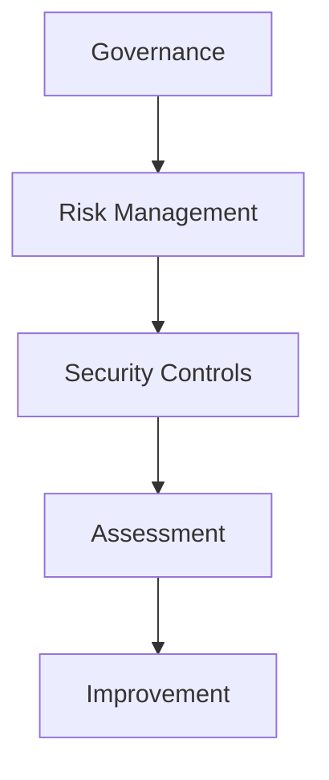

Enigm maintains a formal information security governance model intended to support security, privacy, operational resilience, and continuous improvement.

This document describes Enigm's public governance, compliance, and assurance approach for enterprise customers, security auditors, technical partners, security engineers, and procurement teams.

## Overview

Enigm security assurance is based on governance, risk management, security controls, assessment, and continuous improvement.

The diagram is conceptual and describes the assurance lifecycle at a public governance level.

## Security Governance

Enigm security governance defines how security responsibilities, oversight, and review processes are managed.

Governance includes:

- Defined security responsibilities.
- Security oversight.
- Governance processes.
- Security review processes.
- Accountability for risk decisions.
- Review of security-relevant changes.

Security governance is intended to support consistent decision making and ensure that security remains part of product, platform, and operational planning.

## Risk Management

Security risks are identified, evaluated, prioritized, and addressed through structured risk management processes.

Risk management includes:

- Identification of security risks.
- Evaluation of likelihood and impact.
- Prioritization according to risk.
- Remediation planning.
- Verification of remediation.
- Periodic reassessment.

Risk management supports security governance by ensuring that findings, control gaps, and exposure risks are reviewed according to their security relevance.

## Information Security Management

Enigm operates an information security management framework designed to support:

- Confidentiality.
- Integrity.
- Availability.
- Risk management.
- Continuous improvement.

The information security management framework provides structure for security governance, control review, assurance activities, and compliance program operations.

## Compliance Program

Enigm maintains ISO/IEC 27001:2022 certification.

The certification supports structured information security governance, risk management, control review, and periodic assessment. The certified scope covers the information security management system supporting encrypted messaging application development activities, according to the Statement of Applicability dated 09 September 2024.

The public certificate identifies an issue date of 23 November 2024 and an expiry date of 22 November 2027.

The public certificate is available in [Security Assurance](/security/assurance-evidence). This documentation references the certification without publishing internal audit records, restricted control evidence, internal findings, or assessment workpapers.

The compliance program is designed to support:

- Information security governance.
- Security policy oversight.
- Risk management.
- Control validation.
- Periodic assessment.
- Continuous improvement.

Public documentation summarizes the compliance model without publishing restricted assessment materials.

Certification should be interpreted as evidence of a formal information security management system. It should not be interpreted as an assurance that no vulnerabilities exist, a certification of every product feature, a certification of every deployment, or a replacement for technical security review.

## Certification Scope

ISO/IEC 27001:2022 certification applies to the documented certified scope.

The certified scope covers the information security management system supporting encrypted messaging application development activities, according to the Statement of Applicability dated 09 September 2024.

The ISO 27001 certification scope does not automatically include every Enigm product, infrastructure component, operational process, or future feature unless that item is explicitly included in the applicable certified scope.

Scope interpretation should use careful wording:

- Certified scope.
- Scope expansion.
- Where included.
- Subject to audit scope.

Enigm may expand the certified scope over time to include additional production operations, network operations, key-management workflows, OTA governance, and infrastructure security processes. Any scope expansion should be interpreted according to the applicable audit scope and public certificate evidence.

## Independent Assessments

Enigm performs independent and recurring security assessment activities.

Assessment activities include:

- Private cryptographic assessment.
- Private penetration testing.
- Private mobile application assessment.
- Private infrastructure assessment.
- Periodic security assessments.
- Vulnerability assessments.
- Adversarial security testing.
- Security control reviews.
- Infrastructure exposure reviews.
- Security posture validation.
- Configuration reviews.

These activities are intended to identify vulnerabilities, misconfigurations, control gaps, and exposure risks across supported environments.

Assessment evidence is private and can be requested through enterprise security review under NDA. Public documentation does not publish private reports, sensitive findings, testing scope, remediation records, internal procedures, or assessment workpapers.

## Security Reviews

Security posture is reviewed on a recurring basis.

Security reviews evaluate:

- Security findings.
- Control effectiveness.
- Configuration posture.
- Exposure risks.
- Remediation progress.
- Security-relevant changes.

Findings are prioritized according to risk and addressed through remediation processes. Remediation activities are tracked and verified.

## Cryptographic Assurance

Enigm incorporates post-quantum cryptographic algorithms standardized by NIST as part of its cryptographic architecture.

Cryptographic controls are reviewed as part of the broader security assurance program.

Cryptographic assurance may include:

- Review of cryptographic architecture.
- Review of key management models.
- Review of algorithm selection.
- Review of platform integration boundaries.
- Review of lifecycle and rotation considerations.

References to NIST are limited to standardized cryptographic algorithms and recognized security guidance.

## Continuous Improvement

Security governance includes:

- Ongoing review.
- Control validation.
- Security monitoring.
- Risk reassessment.
- Program improvement.
- Remediation verification.
- Review of assessment outcomes.

Continuous improvement ensures that governance, security controls, and assurance activities evolve as the Enigm ecosystem, threat environment, and customer requirements evolve.

## Security Limitations

Compliance, certification, and assessments improve confidence but do not eliminate security risk.

Limitations include:

- Certification does not ensure the absence of vulnerabilities.
- Assessments may not identify every weakness.
- Security controls require ongoing validation.
- Risk posture may change over time.
- External systems may introduce risk outside Enigm control.
- Governance cannot replace secure engineering, monitoring, incident response, or user security awareness.

Security remains an ongoing process rather than a static state.
