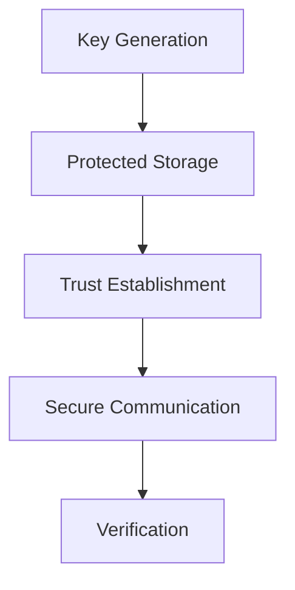

Enigm uses cryptography to provide confidentiality, authenticity, integrity, and trust establishment across multiple components of the ecosystem.

This document defines the public cryptographic architecture, goals, trust assumptions, and lifecycle principles for Enigm at an architecture level suitable for external review.

## Overview

Cryptography is used across Enigm App, Enigm OS, OTA security, Device Trust, secure communications, and release verification.

Cryptographic controls support:

- Confidentiality.
- Integrity.
- Authenticity.
- Device Trust.
- Secure software delivery.
- Verification.
- Trust establishment.
- Long-term resilience against future cryptographic transition risk.

The diagram is conceptual and describes the cryptographic lifecycle at a public architecture level.

## Cryptographic Objectives

The Enigm cryptographic architecture is designed to support:

- Confidentiality of protected communications and sensitive data.
- Integrity of messages, releases, metadata, and security-relevant artifacts.
- Authenticity of devices, releases, and trusted parties.
- Device Trust through protected key material and trust establishment workflows.
- Secure software delivery through release signing and verification.
- Verification of users, devices, and release state.

Cryptography is treated as one part of a broader defense-in-depth model. It is combined with device security, identity controls, Trust Security Center, OTA security, network policy, and governance.

## Cryptographic Principles

Enigm cryptographic design is guided by:

- Least exposure of key material.
- Device-bound trust.
- Hardware-backed protection where available.
- Separation of trust domains.
- Cryptographic agility.
- Defense in depth.
- Verification before trust-sensitive actions.
- Separation between administration and plaintext access.

These principles are intended to reduce key exposure, limit trust assumptions, and preserve independent security boundaries across the ecosystem.

## Public Algorithm Model

Enigm public cryptographic documentation identifies algorithm families and security objectives while keeping protocol messages, implementation-sensitive parameters, key formats, internal storage paths, and operational secrets outside the public record.

At a public architecture level, Enigm uses:

- **AES-256** for symmetric encryption of protected content and data where symmetric encryption is required.
- **ML-KEM**, the NIST-standardized key-encapsulation mechanism derived from CRYSTALS-Kyber, for post-quantum key-establishment objectives.
- **ML-DSA**, the NIST-standardized digital signature algorithm derived from CRYSTALS-Dilithium, for post-quantum signature objectives.
- **TLS 1.3** for authenticated transport protection where transport-layer security is required.
- **HSM-backed key management** for protected key storage, access control, rotation, and auditability of managed cryptographic keys.
- **Secret distribution controls** to reduce reliance on a single recoverable key location or single administrative component.

Public documentation may refer to Kyber and Dilithium because those names appear in Enigm product and white-paper materials. The corresponding NIST-standardized names are ML-KEM and ML-DSA.

Parameter sets, key sizes beyond publicly named algorithm families, message formats, derivation functions, protocol sequencing, and deployable cryptographic implementation detail remain controlled cryptographic material.

## End-to-End Encryption

Enigm messaging relies on end-to-end cryptographic protections.

The secure messaging model is designed so that message plaintext is available only to authorized trusted endpoints. Server-side storage, where required for delivery, stores encrypted message data rather than plaintext message content.

Administrative systems do not provide plaintext access to messages.

End-to-end encryption is separate from network privacy controls such as VPN, proxy infrastructure, traffic shaping, and secure transport. These controls solve different security problems and should be evaluated together rather than treated as substitutes.

At a public architecture level, Enigm secure messaging combines symmetric content encryption, post-quantum key-establishment objectives, post-quantum signature objectives, protected key material, device-bound trust, and verification workflows.

Message confidentiality depends on authorized endpoint devices and protected key material. Server-side systems, Enigm Command workflows, Enigm Server administrators, monitoring systems, and operational systems must not become plaintext access paths.

## Symmetric Content Encryption

Enigm uses AES-256 for symmetric encryption where protected content or data requires symmetric encryption.

Symmetric encryption is used to protect:

- Message content.
- Attachment content.
- Multimedia content.
- Data requiring encrypted storage or transport protection.
- Security-sensitive payloads where symmetric encryption is appropriate.

Cipher modes, nonce handling, padding behavior, payload structure, key derivation details, and internal message formats remain controlled cryptographic material.

AES-256 protects content only when combined with correct key management, trusted devices, authenticated workflows, lifecycle controls, and implementation validation.

## HSM-Backed Key Management

Enigm uses HSM-backed key management for managed cryptographic keys that require protected storage, access control, rotation, and auditability.

At a public architecture level, HSM-backed key management supports:

- Protected storage of managed key material.
- Controlled use of keys through authorized operations.
- Key rotation and lifecycle management.
- Separation of duties for key administration.
- Auditability of security-relevant key operations.
- Reduced exposure of key material to application runtime and administrative workflows.

HSM-backed key management is separate from endpoint-held private key material. It is also separate from the Secret Distribution Model.

HSM-backed key management protects managed platform keys and security-sensitive cryptographic operations. It must not be described as a mechanism that grants Enigm administrators access to message plaintext, attachment plaintext, user communications, or private key material held by trusted user devices.

HSM third-party relationship details, key identifiers, key hierarchy, rotation schedules, access policies, operational procedures, internal storage locations, and implementation-sensitive key-management configuration remain controlled key-management material.

## Post-Quantum Cryptography

Enigm incorporates post-quantum cryptographic algorithms standardized by NIST as part of its cryptographic architecture.

The objective is long-term cryptographic resilience. Post-quantum cryptography is intended to reduce risk from future advances against traditional public-key cryptographic assumptions.

Enigm's post-quantum architecture uses the following public algorithm families:

- **ML-KEM / Kyber** for post-quantum key-establishment objectives.
- **ML-DSA / Dilithium** for post-quantum signature objectives.

NIST FIPS 203 specifies ML-KEM, which is derived from CRYSTALS-Kyber. NIST FIPS 204 specifies ML-DSA, which is derived from CRYSTALS-Dilithium.

Post-quantum cryptography is used as part of a broader architecture. It does not replace Device Trust, protected key storage, end-to-end encryption, verification workflows, security governance, or endpoint hardening.

This document describes post-quantum cryptography at a public architecture level and avoids deployable cryptographic implementation detail.

## Post-Quantum Key Establishment

Post-quantum key establishment is used to support long-term confidentiality objectives for protected communication workflows.

At a public architecture level, the key-establishment model is designed to:

- Establish cryptographic context between authorized participants.
- Support protected message and communication workflows.
- Reduce reliance on classical public-key assumptions alone.
- Support cryptographic agility as standards and implementation requirements evolve.
- Preserve separation between endpoint-held key material and server-side delivery systems.

Exchange transcripts, key derivation details, parameter sets, internal routing behavior, device negotiation behavior, and implementation-sensitive protocol sequencing remain controlled cryptographic material.

## Post-Quantum Signatures

Post-quantum signature workflows are used to support authenticity and integrity objectives.

At a public architecture level, Enigm uses ML-DSA / Dilithium signature objectives to support:

- Message authenticity.
- Message integrity.
- Verification that protected data has not been altered in transit.
- Trust establishment between expected participants or devices.
- Security-sensitive verification workflows where post-quantum signatures are appropriate.

Signature payload formats, verification transcripts, implementation-specific signing contexts, internal identifiers, and operational signing material remain controlled cryptographic material.

## Secret Distribution Model

Enigm uses a secret distribution model to reduce reliance on a single recoverable key location or single administrative component.

The model is intended to ensure that protected cryptographic material or authorization context is not exposed through one server-side system, one administrator, one storage layer, or one operational workflow.

At a public architecture level, secret distribution supports:

- Separation of trust domains.
- Reduced single-point exposure.
- Key lifecycle controls.
- Recovery boundary separation.
- Resistance to unilateral administrative plaintext access.

Split thresholds, participant roles, reconstruction logic, storage locations, internal secret-handling systems, and operational procedures remain controlled security material.

Secret distribution does not grant Enigm administrators access to message plaintext. It is a defense-in-depth control that complements endpoint-held protected key material, end-to-end encryption, and Device Trust.

HSM-backed key management and secret distribution serve different purposes. HSM-backed key management protects managed keys and controlled cryptographic operations; secret distribution reduces reliance on a single recoverable secret location or unilateral administrative recovery path.

## Data At Rest

Data handled by Enigm is encrypted at rest according to the applicable product, storage, and security domain.

At a public architecture level, data-at-rest protection includes:

- Data-level encryption where protected records require encryption.
- Platform storage encryption according to the applicable storage domain.
- Disk or storage-layer encryption according to the applicable storage domain.
- Hashing for data that does not require reversibility.
- Key rotation and lifecycle controls.
- HSM-backed key management for managed platform keys where appropriate.

Where hashing is used for non-reversible data, it should be combined with appropriate salting and protection controls. Hash construction details, salt generation mechanics, storage schemas, and key-management implementation details remain controlled security material.

Encryption at rest is not the same as end-to-end encryption. Data-at-rest encryption protects stored data within storage and operational domains, while end-to-end encryption protects message content so that plaintext is intended to be available only to authorized trusted endpoints.

## Data In Transit

Enigm uses authenticated transport protection where transport-layer security is required.

At a public architecture level, transport protection includes:

- TLS 1.3 for protected transport channels.
- TLS 1.2 compatibility only where required for supported clients and restricted to approved strong cipher suites.
- Authenticated communication paths.
- Encrypted payload transport.
- Request integrity controls where required.
- Separation between transport security and message-content confidentiality.

Transport encryption protects communication paths, but it does not replace end-to-end encryption, protected key material, Device Trust, or verification workflows.

## Public Web Transport Security

Public web surfaces are protected with a strict transport-security baseline.

At a public architecture level, this baseline includes:

- TLS certificates issued for public proxied hostnames.
- Automated certificate lifecycle management for public web names.
- HTTP Strict Transport Security for public web access.
- HSTS maximum age of 6 months.
- HSTS subdomain coverage enabled.
- Encrypted Client Hello enabled for supported clients and public web access paths.
- Certificate authority selection managed through approved public certificate issuance workflows.

Encrypted Client Hello improves privacy during supported TLS handshakes by encrypting the ClientHello message, including the server-name indication that would otherwise be visible in the handshake.

Public web transport controls are separate from Enigm App end-to-end encryption. They protect public web access paths and transport metadata for compatible clients, but they do not replace message encryption, Device Trust, protected key material, or verification workflows.

Certificate authority names, public edge relationship names, internal hostnames, non-public domains, private routing topology, certificate automation internals, and operational deployment details remain controlled operational material.

## TLS Cipher Suite Baseline

For TLS 1.2 compatibility on supported public web paths, Enigm uses a restricted strong cipher-suite baseline.

The public TLS 1.2 compatibility baseline includes:

| Cipher Suite | Minimum TLS Version | Authentication |
| --- | --- | --- |
| ECDHE-ECDSA-AES128-GCM-SHA256 | TLS 1.2 | ECDSA |
| ECDHE-ECDSA-CHACHA20-POLY1305 | TLS 1.2 | ECDSA |
| ECDHE-RSA-AES128-GCM-SHA256 | TLS 1.2 | RSA |
| ECDHE-RSA-CHACHA20-POLY1305 | TLS 1.2 | RSA |
| ECDHE-ECDSA-AES256-GCM-SHA384 | TLS 1.2 | ECDSA |
| ECDHE-RSA-AES256-GCM-SHA384 | TLS 1.2 | RSA |

TLS 1.3 remains the preferred transport baseline for compatible clients.

Cipher-suite documentation is limited to public web transport posture. It should not be interpreted as disclosure of internal service topology, private endpoints, application protocol internals, or message-encryption protocol details.

## Key Lifecycle

Cryptographic keys are managed through lifecycle events.

The key lifecycle includes:

- Generation.
- Protection.
- Rotation.
- Replacement.
- Revocation.

Key lifecycle controls are intended to ensure that keys are created in trusted contexts, protected during use, replaced when required, and no longer trusted after revocation.

Key lifecycle decisions may apply to messaging keys, Device Trust keys, release signing keys, manifest signing keys, and other cryptographic material used by Enigm components.

Key lifecycle management is evaluated together with hardware-backed protection where available, protected device storage, HSM-backed key management, key wrapping, rotation, revocation, and secret distribution controls.

## Device-Bound Trust

Private key material is intended to remain associated with trusted devices.

Device-bound trust supports:

- Trusted device association.
- Secure messaging access.
- Secure call workflows.
- Multi-Device Trust establishment.
- Device revocation.
- Trust Security Center and managed device workflows.

Device-bound trust does not mean that a device is permanently trusted. Device Trust may change based on lifecycle events, revocation, replacement, security posture, or policy decisions.

## Secure Storage

Protected device storage mechanisms are used for private key protection.

Hardware-backed protection is used where available. On supported mobile platforms, secure storage may use platform-provided protected storage and hardware-backed key protection capabilities.

Where hardware boundaries cannot directly store larger cryptographic material, protected wrapping or access-control material may be used to protect key material outside the secure hardware boundary.

Private key material must not be stored in plaintext.

Secure storage reduces key exposure but does not eliminate endpoint compromise risk.

On iOS, Enigm App uses Keychain and Secure Enclave-backed protection where available and appropriate. On Android, Enigm App uses Android Keystore-backed protection, including hardware-backed Keystore or StrongBox-backed protection according to device class and deployment capability.

## Verification Workflows

Verification may be used to establish trust between devices, users, and releases.

Verification workflows may support:

- Device Trust establishment.
- Contact or device verification.
- Multi-device enrollment.
- Release authenticity checks.
- Manifest verification.
- Artifact verification.
- Trust state review.

Verification is intended to reduce reliance on implicit trust. It does not replace user awareness, device security, or protected key material.

## OTA Cryptography

OTA security uses cryptographic controls to protect release trust and software delivery.

OTA cryptography includes:

- Release signing.
- Manifest verification.
- Artifact verification.
- Eligibility controls.

Release signing establishes release authenticity. Manifest verification protects release metadata. Artifact verification protects update content. Eligibility controls help determine whether a device should receive a release.

OTA cryptography does not replace verified boot, Remote Attestation, production gates, Device Trust evaluation, or client verification.

## Cryptographic Agility

Cryptographic agility is a design objective.

Enigm cryptographic architecture should support review and evolution of:

- Algorithm selection.
- Key lifecycle requirements.
- Post-quantum migration requirements.
- Signature and verification workflows.
- Secure storage capabilities.
- Transport protection requirements.
- Release signing requirements.
- HSM-backed key management requirements.

Cryptographic agility does not mean uncontrolled algorithm substitution. Changes to cryptographic architecture should be reviewed through secure development, security governance, release controls, and assurance processes.

## Cryptographic Limitations

Cryptography protects data and trust relationships, but it does not eliminate all security risk.

Cryptography does not protect against:

- Social engineering.
- Malicious trusted users.
- Compromised endpoints.
- Future unknown vulnerabilities.
- Authorized users disclosing plaintext.
- External recording or capture outside Enigm controls.
- Weak operational practices outside cryptographic boundaries.
- Incorrect implementation of otherwise appropriate algorithms.
- Misconfigured policy or lifecycle controls.

Cryptography should be evaluated as part of the broader Enigm security architecture, including Device Trust, secure identity, Trust Security Center, OTA security, network policy, incident response, and security governance.

## Public Standards References

Relevant public standards references include:

- [NIST FIPS 203: Module-Lattice-Based Key-Encapsulation Mechanism Standard](https://csrc.nist.gov/pubs/fips/203/final)
- [NIST FIPS 204: Module-Lattice-Based Digital Signature Standard](https://csrc.nist.gov/pubs/fips/204/final)

References to NIST standards mean that Enigm incorporates post-quantum cryptographic algorithms standardized by NIST as part of its cryptographic architecture. They do not mean that NIST has certified, approved, audited, or endorsed Enigm as a product.

## Cryptographic Assessment

Enigm cryptographic architecture is assessed through private security review processes. Current cryptographic assessment evidence is available to enterprise customers, auditors, and technical partners under NDA through Enigm's security review process.

Assessment scope includes end-to-end encryption implementation, post-quantum cryptography integration, key management, device-bound key protection, multi-device trust, secure messaging, secure calls, OTA signing, and verification workflows.

Enigm does not publish the full cryptographic assessment report publicly because it can contain sensitive findings, remediation history, protocol details, or implementation information. Where approved for public distribution, Enigm can provide assessment scope, reporting period, high-level summary, remediation status categories, or executive summary material.
