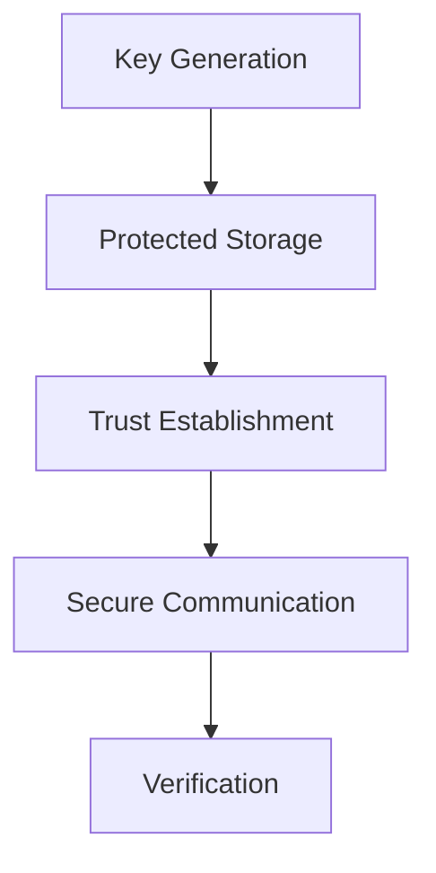

Enigm uses cryptography to provide confidentiality, authenticity, integrity, and trust establishment across multiple components of the ecosystem.

This document defines the public cryptographic architecture, goals, trust assumptions, and lifecycle principles for Enigm at an architecture level suitable for external review.

This document is intended for security auditors, enterprise customers, technical partners, security engineers, and cryptography reviewers.

## Overview

Cryptography is used across Enigm App, Enigm OS, OTA security, device trust, secure communications, and release verification.

Cryptographic controls support:

- Confidentiality.
- Integrity.
- Authenticity.
- Device trust.
- Secure software delivery.
- Verification.
- Trust establishment.

The diagram is conceptual and describes the cryptographic lifecycle at a public architecture level.

## Cryptographic Objectives

The Enigm cryptographic architecture is designed to support:

- Confidentiality of protected communications and sensitive data.
- Integrity of messages, releases, metadata, and security-relevant artifacts.
- Authenticity of devices, releases, and trusted parties where applicable.
- Device trust through protected key material and trust establishment workflows.
- Secure software delivery through release signing and verification.
- Verification of users, devices, and release state.

Cryptography is treated as one part of a broader defense-in-depth model. It is combined with device security, identity controls, Trust Security Center, OTA security, network policy, and governance.

## Cryptographic Principles

Enigm cryptographic design is guided by:

- Least exposure of key material.
- Device-bound trust.
- Hardware-backed protection where available.
- Separation of trust domains.
- Cryptographic agility.
- Defense in depth.
- Verification before trust-sensitive actions.
- Separation between administration and plaintext access.

These principles are intended to reduce key exposure, limit trust assumptions, and preserve independent security boundaries across the ecosystem.

## End-to-End Encryption

Enigm messaging relies on end-to-end cryptographic protections.

The secure messaging model is designed so that message plaintext is available only to authorized trusted endpoints. Server-side storage, where required for delivery, stores encrypted message data rather than plaintext message content.

Administrative systems do not provide plaintext access to messages.

End-to-end encryption is separate from network privacy controls such as VPN, proxy infrastructure, traffic shaping, and secure transport. These controls solve different security problems and should be evaluated together rather than treated as substitutes.

## Post-Quantum Cryptography

Enigm incorporates post-quantum cryptographic algorithms standardized by NIST as part of its cryptographic architecture.

The objective is long-term cryptographic resilience. Post-quantum cryptography is intended to reduce risk from future advances against traditional public-key cryptographic assumptions.

This document describes post-quantum cryptography at a public architecture level and avoids deployable cryptographic implementation detail.

## Key Lifecycle

Cryptographic keys are managed through lifecycle events.

The key lifecycle includes:

- Generation.
- Protection.
- Rotation.
- Replacement.
- Revocation.

Key lifecycle controls are intended to ensure that keys are created in trusted contexts, protected during use, replaced when required, and no longer trusted after revocation.

Key lifecycle decisions may apply to messaging keys, device trust keys, release signing keys, manifest signing keys, and other cryptographic material used by Enigm components.

## Device-Bound Trust

Private key material is intended to remain associated with trusted devices.

Device-bound trust supports:

- Trusted device association.
- Secure messaging access.
- Secure call workflows.
- Multi-device trust establishment.
- Device revocation.
- Trust Security Center and managed device workflows where applicable.

Device-bound trust does not mean that a device is permanently trusted. Device trust may change based on lifecycle events, revocation, replacement, security posture, or policy decisions.

## Secure Storage

Protected device storage mechanisms are used for private key protection.

Hardware-backed protection is used where available. On supported mobile platforms, secure storage may use platform-provided protected storage and hardware-backed key protection capabilities.

Where hardware boundaries cannot directly store larger cryptographic material, protected wrapping or access-control material may be used to protect key material outside the secure hardware boundary.

Private key material must not be stored in plaintext.

Secure storage reduces key exposure but does not eliminate endpoint compromise risk.

## Verification Workflows

Verification may be used to establish trust between devices, users, and releases.

Verification workflows may support:

- Device trust establishment.
- Contact or device verification where supported.
- Multi-device enrollment.
- Release authenticity checks.
- Manifest verification.
- Artifact verification.
- Trust state review.

Verification is intended to reduce reliance on implicit trust. It does not replace user awareness, device security, or protected key material.

## OTA Cryptography

OTA security uses cryptographic controls to protect release trust and software delivery.

OTA cryptography includes:

- Release signing.
- Manifest verification.
- Artifact verification.
- Eligibility controls.

Release signing establishes release authenticity. Manifest verification protects release metadata. Artifact verification protects update content. Eligibility controls help determine whether a device should receive a release.

OTA cryptography does not replace verified boot, remote attestation, production gates, device trust evaluation, or client verification.

## Cryptographic Limitations

Cryptography protects data and trust relationships, but it does not eliminate all security risk.

Cryptography does not protect against:

- Social engineering.
- Malicious trusted users.
- Compromised endpoints.
- Future unknown vulnerabilities.
- Authorized users disclosing plaintext.
- External recording or capture outside Enigm controls.
- Weak operational practices outside cryptographic boundaries.

Cryptography should be evaluated as part of the broader Enigm security architecture, including device trust, secure identity, Trust Security Center, OTA security, network policy, incident response, and security governance.
