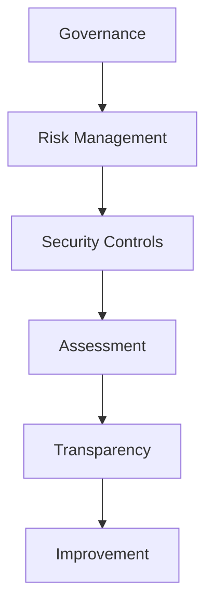
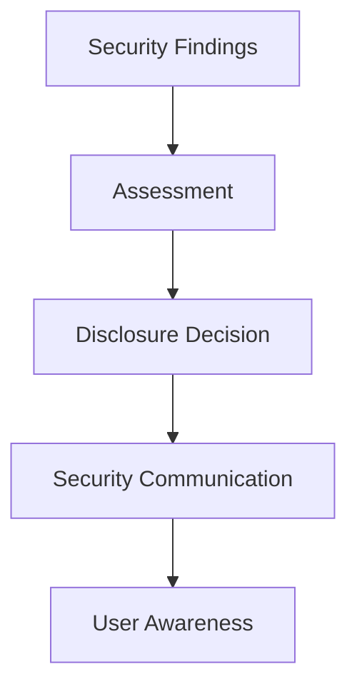

Enigm maintains a formal information security governance model intended to support security, privacy, operational resilience, compliance, assurance, and continuous improvement.

This page consolidates Enigm's public governance, compliance, assurance evidence, transparency model, and ongoing security validation practices.

## Overview

Security governance at Enigm is based on governance, risk management, security controls, assessment, transparency, and continuous improvement.

The diagram is conceptual and describes the assurance lifecycle at a public governance level.

## Security Governance

Enigm security governance defines how security responsibilities, oversight, and review processes are managed.

Governance includes:

- Defined security responsibilities.
- Security oversight.
- Governance processes.
- Security review processes.
- Accountability for risk decisions.
- Review of security-relevant changes.

Security governance supports consistent decision making and ensures that security remains part of product, platform, privacy, and operational planning.

## Risk Management

Security risks are identified, evaluated, prioritized, and addressed through structured risk management processes.

Risk management includes:

- Identification of security risks.
- Evaluation of likelihood and impact.
- Prioritization according to risk.
- Remediation planning.
- Verification of remediation.
- Periodic reassessment.

Risk management supports security governance by ensuring that findings, control gaps, and exposure risks are reviewed according to their security relevance.

## Information Security Management

Enigm operates an information security management framework designed to support:

- Confidentiality.
- Integrity.
- Availability.
- Risk management.
- Continuous improvement.

The information security management framework provides structure for security governance, control review, assurance activities, and compliance program operations.

## Compliance

Enigm maintains ISO/IEC 27001:2022 certification.

The certification supports structured information security governance, risk management, control review, and periodic assessment. The certified scope covers the information security management system supporting encrypted messaging application development activities, including related development governance, supporting development infrastructure, internal security policies, and company processes included in the Statement of Applicability dated 09 September 2024.

The public certificate identifies:

- Certified organization: ENIGM, LLC.
- Standard: ISO/IEC 27001:2022.
- Certification issue date: 23 November 2024.
- Original certificate issue date: 23 November 2024.
- Certificate expiry date: 22 November 2027.
- Statement of Applicability date: 09 September 2024.

The certificate scope is:

> System that supports the activities of encrypted messaging application development, according to the Statement of Applicability dated 09/09/2024.

The certificate is available for public review:

<Card title="ISO/IEC 27001:2022 Certificate" href="/assets/compliance/enigm-iso-27001-certificate.pdf">
  Public certificate for ENIGM, LLC. information security management system.
</Card>

Certification should be interpreted as evidence of a formal information security management system. It should not be interpreted as an assurance that no vulnerabilities exist, a certification of every product feature, a certification of every deployment, or a replacement for technical security review.

## Certification Scope

ISO/IEC 27001:2022 certification applies to the documented certified scope.

The certified scope covers the information security management system supporting encrypted messaging application development activities, including related development governance, supporting development infrastructure, internal security policies, and company processes included in the Statement of Applicability. It does not automatically certify every individual Enigm product feature, customer deployment, future feature, or third-party service boundary unless that item is explicitly included in the applicable certified scope.

Scope interpretation should use careful wording:

- Certified scope.
- Scope expansion.
- Where included.
- Subject to audit scope.

Enigm can expand or refine the certified scope over time to include additional production operations, network operations, key-management workflows, OTA governance, and infrastructure security processes. Any scope interpretation should be evaluated according to the applicable audit scope, Statement of Applicability, and public certificate evidence.

## Assurance Evidence

Security assurance at Enigm is based on formal governance, risk management, recurring security review, independent assessment, and continuous improvement.

Assurance evidence supports review of:

- Information security governance.
- Privacy-oriented platform design.
- Data minimization and content confidentiality.
- Secure development practices.
- Security monitoring and incident readiness.
- Cryptographic architecture review.
- Controlled software delivery.
- Compliance posture.

Public assurance evidence is organized around the following categories:

| Category | Public Assurance Purpose |
| --- | --- |
| Governance | Demonstrates that security responsibilities, oversight, and review processes exist. |
| Risk management | Demonstrates that risks are identified, prioritized, addressed, and reassessed. |
| Secure development | Demonstrates that software development includes review, validation, and release controls. |
| Cryptography | Demonstrates that cryptographic architecture is governed and reviewed as part of security assurance. |
| Privacy | Demonstrates that data minimization, identity minimization, and metadata reduction are design objectives. |
| Incident response | Demonstrates that security events are handled through structured response governance. |
| Monitoring | Demonstrates that operational and security visibility support investigation and resilience. |
| Compliance | Demonstrates alignment with formal information security governance and assessment practices. |

Assurance evidence does not replace technical due diligence, contractual review, deployment review, or customer-specific security assessment.

## Independent Assessments

Enigm performs independent and recurring security assessment activities.

Assessment activities include:

- Private cryptographic assessment.
- Private penetration testing.
- Private mobile application assessment.
- Private infrastructure assessment.
- Periodic security assessments.
- Vulnerability assessments.
- Adversarial security testing.
- Security control reviews.
- Infrastructure exposure reviews.
- Security posture validation.
- Configuration reviews.

These activities are intended to identify vulnerabilities, misconfigurations, control gaps, and exposure risks across supported environments.

## Ongoing Security Validation

Enigm performs continuous and periodic security validation activities intended to improve accountability, security posture, and public trust.

Validation practices include:

- Automated vulnerability assessment.
- Infrastructure exposure reviews.
- Security posture validation.
- Configuration reviews.
- Attack surface monitoring.
- Security control validation.
- Periodic adversarial testing.
- Simulated attack exercises.
- Continuous monitoring.
- Security review cycles.

### Periodic Security Assessments

Enigm performs recurring security assessments intended to identify vulnerabilities, misconfigurations, and exposure risks across supported environments.

Assessment outcomes inform remediation priorities, security review, release planning, and governance review where appropriate.

### Adversarial Security Testing

Enigm performs periodic adversarial security exercises intended to simulate attacker behavior and evaluate detection, visibility, and defensive controls.

These exercises are intended to improve:

- Detection capabilities.
- Security monitoring.
- Incident response readiness.
- Defensive controls.
- Security posture.

### Continuous Security Validation

Security controls are reviewed on an ongoing basis through automated and manual validation processes.

Continuous validation supports security awareness, control verification, and improvement of Enigm's security posture over time.

### Governance

Security reviews occur regularly. Security posture is periodically reassessed, findings are prioritized according to risk, and remediation activities are tracked and verified.

## Security Reviews

Security posture is reviewed on a recurring basis.

Security reviews evaluate:

- Security findings.
- Control effectiveness.
- Configuration posture.
- Exposure risks.
- Remediation progress.
- Security-relevant changes.

Findings are prioritized according to risk and addressed through remediation processes. Remediation activities are tracked and verified.

## Cryptographic Assurance

Enigm incorporates post-quantum cryptographic algorithms standardized by NIST as part of its cryptographic architecture.

This statement means that Enigm uses NIST-standardized post-quantum cryptographic algorithms as part of its architecture. It does not mean:

- NIST has certified Enigm.
- NIST has approved Enigm as a product.
- NIST has audited Enigm.
- Every Enigm component uses the same cryptographic mechanism.

Cryptographic assurance is reviewed as part of the broader security assurance program, including key lifecycle, device-bound trust, secure storage, verification workflows, and controlled software delivery.

## Privacy Assurance

Enigm security assurance is evaluated in the context of privacy.

Security exists to support:

- Privacy by design.
- Data minimization.
- Identity minimization.
- Metadata reduction.
- Content confidentiality.
- Privacy-Preserving Device Handles.
- User control.

Assurance review should verify that security controls do not create unnecessary collection, retention, or exposure of protected content.

Administrative systems are not intended to provide plaintext access to messages, calls, media, attachments, or user conversations.

## Transparency

Enigm approaches transparency as a security, privacy, and accountability practice. Public security communication should improve trust, support informed decisions, and help auditors, customers, partners, and engineers understand Enigm's security posture.

Transparency balances:

- User trust.
- Privacy.
- Security.
- Operational safety.

## Security Transparency Principles

Enigm security transparency is guided by:

- Accuracy.
- Accountability.
- Timely communication.
- Responsible disclosure.
- Continuous improvement.
- Risk-aware communication.
- Protection of users and platform integrity.
- Data minimization and content confidentiality.

Transparency supports informed review without increasing risk to users or platform integrity.

## Security Advisories

Security advisories can be published when vulnerabilities, security updates, or important security changes affect the platform.

Advisories can describe:

- Affected security area.
- User impact at an appropriate level.
- Available mitigations.
- Security update information.
- Recommended user or administrator action.

Security advisories provide enough information to support informed decisions while avoiding unnecessary exposure of sensitive technical material.

## Vulnerability Disclosure

Enigm supports responsible vulnerability disclosure.

Security reports are evaluated, validated, and prioritized according to risk. Evaluation considers technical impact, exploitability, affected users, affected components, and available mitigations.

Disclosure handling preserves confidentiality while a report is being reviewed and while remediation is being prepared.

## Responsible Disclosure

Researchers are encouraged to report security issues responsibly.

Responsible disclosure is intended to:

- Protect users.
- Support coordinated remediation.
- Preserve evidence for technical review.
- Avoid premature publication of sensitive details.
- Improve security through constructive reporting.

Reports should include enough technical context to support validation without including unnecessary sensitive data.

## Security Communications

Security communications provide sufficient information to support informed decisions without increasing risk to users.

Security communication balances:

- Accuracy.
- Timeliness.
- User impact.
- Operational safety.
- Remediation status.
- Disclosure sensitivity.

Communication can vary depending on severity, user impact, remediation availability, and legal or contractual obligations.

## Release Transparency

The platform can publish security-relevant release information.

Release transparency can include:

- Release information.
- Security improvements.
- Security-relevant changes.
- Security update information.
- Guidance for users or administrators.

Release transparency supports auditability and user awareness while preserving sensitive implementation details.

## Evidence Boundaries

Public assurance evidence is intentionally limited.

Restricted evidence can be handled through appropriate enterprise, legal, procurement, or audit review processes when required.

## Continuous Improvement

Security governance includes:

- Ongoing review.
- Control validation.
- Security monitoring.
- Risk reassessment.
- Program improvement.
- Remediation verification.
- Review of assessment outcomes.

Continuous improvement ensures that governance, security controls, and assurance activities evolve as the Enigm ecosystem, threat environment, and customer requirements evolve.

## Implementation and Validation Status

Public Enigm documentation describes implemented production products and production capabilities unless a section explicitly identifies a target hardening layer or scoped deployment model.

| Area | Public Status | Validation Model |
| --- | --- | --- |
| Enigm App secure messaging, secure calls, key management, and multi-device workflows | Implemented and in production | Private security and cryptographic assessment evidence available under NDA. |
| VPN Service and Proxy Network | Implemented and in production | Private infrastructure assessment evidence available under NDA. |
| Enigm Command, Enigm Server, Enigm eSIM, and Enigm Key | Implemented and in production | Private product, infrastructure, and security review evidence available under NDA. |
| Enigm OS, Trust Security Center, OTA Architecture, Remote Attestation, and Hardware-Backed Signing | Implemented and in production | Private mobile, device, OTA, and infrastructure assessment evidence available under NDA. |
| Target Production Release-Signing Authority | Target hardening architecture | Documented separately from the current production OTA manifest signing authority. |
| Enyra and Enigm Intelligence | Implemented and in production | Private security review evidence available under NDA. |
| Secure SDLC and governance program | Implemented and in production | ISO/IEC 27001:2022 certificate and governance evidence available. |

Private assessment evidence can include cryptographic assessment, penetration testing, mobile application assessment, infrastructure assessment, and broader security review material. It is not published publicly when it could reveal sensitive findings, scope details, remediation history, or implementation information.

## Related Documents

- [Security Model](/security/security-model)
- [Privacy](/security/privacy)
- [Threat Model](/security/threat-model)
- [Cryptography](/security/cryptography)
- [Transparency Report](/security/transparency-report)
- [Secure SDLC](/infrastructure/secure-sdlc)
- [Operations and Resilience](/infrastructure/operations-resilience)
- [Platform Limitations](/legal/limitations)
