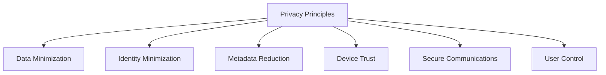

Enigm is designed around the principle that privacy should be a foundational property of the platform rather than an optional feature.

This document explains the privacy intent that drives the Enigm ecosystem. It is different from the Privacy Model: Privacy Principles explain why Enigm is designed this way, while the Privacy Model explains how privacy expectations are applied across system components.

This document is intended for enterprise customers, privacy-conscious users, security auditors, and technical partners.

## Overview

Enigm is privacy-oriented by design. The ecosystem is intended to minimize unnecessary collection, reduce identity exposure, lower metadata visibility, and protect user communications.

Privacy is treated as a platform objective that informs product architecture, security controls, Device Trust, network design, and governance.

## Privacy By Design

Privacy considerations are intended to be incorporated into platform design decisions from the beginning.

Privacy by design means:

- Privacy is considered during product architecture.
- Security controls are evaluated for privacy impact.
- Data collection is reviewed against defined purposes.
- Metadata exposure is treated as a security and privacy concern.
- Administrative visibility is kept separate from plaintext access.

## Data Minimization

The platform is designed to collect and retain only the information required to operate services, maintain security, and support platform integrity.

Data minimization means:

- Limited collection.
- Purpose limitation.
- Minimal retention.
- Access control.
- Security review of data handling.
- Separation between protected content and operational metadata.

Enigm describes data collection and retention in terms of necessity, scope, and purpose.

## Identity Minimization

The platform is designed to reduce unnecessary dependence on public identifiers where possible.

Identity minimization supports:

- Reduced exposure of direct user identifiers.
- Preference for privacy-preserving identifiers where appropriate.
- Separation between account identity, Device Trust, and message content.
- Scoped use of identity context for authorized workflows.
- Reduced unnecessary identity metadata in security and operational records.

Identity-minimizing design does not remove all identity requirements. Some identity context is required for account security, authorization, device lifecycle, abuse prevention, and compliance obligations.

## Metadata Reduction

Enigm includes multiple layers intended to reduce metadata exposure and communication-pattern visibility.

Metadata-reducing controls may include:

- Privacy-preserving identifiers.
- Traffic separation.
- Traffic shaping.
- Network protections.
- Device Trust controls.
- Data minimization.
- Purpose-limited security visibility.

Metadata reduction is intended to lower exposure and reduce confidence in simple communication-pattern inference. It should not be interpreted as an absolute identity or traffic-analysis assurance.

## Device Trust

Device Trust contributes to privacy by helping ensure that protected information is accessed only by expected devices.

Device Trust supports:

- Explicit device association.
- Device revocation.
- Multi-Device Trust establishment.
- Trust Security Center posture.
- Managed device visibility where enabled.
- Remote Attestation for workflows that require device-integrity evidence.

Device Trust is a privacy control because compromised, unknown, or revoked devices can create exposure risk for protected communications and identity workflows.

## User Control

Users should remain in control of their devices, identities, and communications.

User control includes:

- Explicit device enrollment.
- Device review and revocation.
- Account lifecycle decisions.
- Privacy Mode.
- Verification workflows.
- Message expiration and secure handling controls.

User control should be understandable and actionable without requiring users to understand internal system mechanics.

## Secure Communications

Confidentiality protections are intended to support private communications.

Secure communications rely on:

- End-to-end encryption.
- Protected key material.
- Trusted device association.
- Verification workflows.
- Secure message and attachment handling.
- Separation between administrative systems and plaintext access.

Administrative systems are not intended to provide plaintext access to messages, calls, media, attachments, or user conversations.

## Security As Privacy Enabler

Security controls exist to support privacy objectives.

Examples include:

- Device integrity.
- Trusted software delivery.
- End-to-end encryption.
- Remote Attestation.
- Hardware-backed signing.
- Trust Security Center posture.
- Secure device management.
- Controlled rollout infrastructure.

Security helps preserve privacy by reducing unauthorized access, limiting exposure, supporting trusted device decisions, and protecting the integrity of software and communications.

## Continuous Improvement

Privacy is an ongoing objective rather than a static feature.

Continuous improvement includes:

- Reviewing privacy and security controls.
- Reducing unnecessary data collection over time.
- Improving metadata-reducing controls.
- Reassessing identity exposure.
- Reviewing retention and deletion practices.
- Improving security controls that support privacy.

The Enigm ecosystem should continue to evolve toward lower exposure, stronger confidentiality, and better user control as platform capabilities and threat conditions change.
