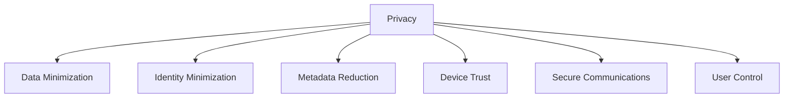

Enigm is designed around the principle that privacy is a foundational property of the platform rather than an optional feature. Security controls exist to support that privacy objective by protecting content confidentiality, reducing identity exposure, minimizing metadata, and preserving user control.

The Enigm privacy model applies across Enigm App, Enigm Command, Enigm Server, Enigm OS, Trust Security Center, VPN Service, Proxy Network, Tor Gateway, Threat Intelligence Platform, Enyra, Enigm Key, Enigm eSIM, and OTA Architecture.

## Overview

Enigm is privacy-oriented by design. The ecosystem is intended to minimize unnecessary collection, reduce dependence on public identifiers, lower metadata visibility, and protect user communications.

Privacy decisions are evaluated together with product architecture, Device Trust, network design, security governance, and lifecycle controls. Enigm uses privacy-oriented and identity-minimizing language carefully; metadata reduction should not be interpreted as an absolute identity or traffic-analysis assurance.

## Privacy By Design

Privacy considerations are incorporated into platform design decisions from the beginning.

Privacy by design means:

- Privacy is considered during product architecture.
- Security controls are evaluated for privacy impact.
- Data collection is reviewed against defined purposes.
- Metadata exposure is treated as a security and privacy concern.
- Administrative visibility is kept separate from plaintext access.

## Data Minimization

The platform is designed to collect and retain only the information required to operate services, maintain security, support platform integrity, handle account lifecycle, and meet applicable legal obligations.

Data minimization means:

- Limited collection.
- Purpose limitation.
- Minimal retention.
- Access control.
- Security review of data handling.
- Separation between protected content and operational metadata.

Data handled by Enigm is encrypted at rest according to the applicable product, storage, and security domain. Encryption at rest complements, but does not replace, end-to-end encryption, Device Trust, access control, retention limits, or deletion workflows.

## Identity Minimization

The platform is designed to reduce unnecessary dependence on public identifiers where possible.

Standard Enigm account registration uses an identity-minimizing model and does not require an email address, phone number, or identity document. Standard account creation uses username and password authentication, recovery phrase generation and handling, device-local identity creation, and explicit trusted-device association.

Identity minimization supports:

- Reduced exposure of direct user identifiers.
- Preference for Privacy-Preserving Device Handles where appropriate.
- Separation between account identity, Device Trust, and message content.
- Scoped use of identity context for authorized workflows.
- Reduced unnecessary identity metadata in security and operational records.

Identity-minimizing design does not remove all identity requirements. Some identity context is required for account security, authorization, device lifecycle, abuse prevention, support, and compliance obligations.

## Metadata Reduction

Enigm includes multiple layers intended to reduce metadata exposure and communication-pattern visibility.

Metadata-reducing controls include:

- Privacy-Preserving Device Handles.
- Traffic separation.
- Traffic shaping.
- Network protections.
- Device Trust controls.
- Data minimization.
- Purpose-limited security visibility.

Metadata reduction is intended to lower exposure and reduce confidence in simple communication-pattern inference. It should not be interpreted as guaranteed anonymity, untraceability, or complete resistance to advanced traffic analysis.

## Jurisdiction And GDPR/RGPD Alignment

Enigm's core platform infrastructure is operated under Enigm's Swiss subsidiary and Swiss legal governance. This includes Enigm-held customer records, account lifecycle services, platform APIs, public web surfaces, and supporting internal platform services. For processing activities involving users in the European Union, Enigm is designed to align with GDPR/RGPD principles including purpose limitation, data minimization, storage limitation, confidentiality, integrity, and accountability.

This governance statement applies to Enigm-operated services and does not imply that Enigm operates third-party carrier infrastructure used for Enigm eSIM carrier-layer connectivity.

Server region selection is a product and deployment control for dedicated Enigm Server customer environments. Enigm Server dedicated environments are deployed in the selected public region category and remain distinct from the Enigm core platform. Region selection does not create a different plaintext access model and does not weaken Enigm end-to-end encryption, Device Trust, or metadata minimization.

## Data Categories

### Account And App Data

Enigm App account data supports authentication, authorization, account lifecycle, secure messaging, secure calls, and multi-device management. Protected content remains separated from operational metadata by design.

Enigm App sessions are limited to 6 hours. Session state is treated as account access state and remains separate from Device Trust, recovery state, protected key material, and message plaintext.

Enigm App secure media handling is designed to reduce unnecessary plaintext exposure for files, images, videos, attachments, and other supported multimedia. Conversation and group policy can control sending, forwarding, deletion, and media handling without giving administrative systems plaintext access to protected content.

Capture-resistance controls reduce screenshot, screen-recording, preview, or external-export exposure according to device capability and policy. These controls complement end-to-end encryption and Device Trust; they do not ensure protection against compromised endpoints, external cameras, malicious authorized users, or modified operating environments.

### Privacy-Preserving Device Handles

Privacy-Preserving Device Handles support Controlled Device Management, policy assignment, audit correlation, OTA Eligibility, and Remote Attestation without requiring public exposure of direct device identifiers.

They are intended to reduce dependence on public identifiers while preserving authorized lifecycle and security review.

### Enigm OS Security State

Enigm OS security state includes Trust Security Center posture, network-policy state, privacy-mode state, device-management lifecycle state, and OTA verification state. This state is limited to authorized product and administrative workflows.

### Enigm Server Data

Enigm Server data supports dedicated private messaging environments, server ID join requests, administrator approval decisions, server membership, server-scoped content lifecycle controls, geographic deployment region selection, and server audit visibility where appropriate.

Enigm Server metadata is minimized and separated from protected message content, attachment plaintext, user communications, and private key material. Server-scoped lifecycle controls affect encrypted content availability and lifecycle without creating plaintext access or cryptographic authority for administrators.

Administrative deletion controls operate on encrypted content objects and lifecycle state. Deletion affects content availability and lifecycle; it does not imply content visibility, content decryption, or access to protected communications.

### Network Privacy Metadata

VPN Service and Proxy Network use policy metadata to enforce access, evaluate risk, or support troubleshooting for Enigm App network privacy and traffic-separation flows. Tor Gateway uses policy metadata for supported public web access paths.

Network-policy records are minimized, purpose-limited, and separated from message, call, media, and attachment content. Limited operational identifiers can be required for routing, request handling, authentication, abuse prevention, security monitoring, and availability. These identifiers remain minimized, protected, and scoped to their operational purpose.

### Enigm eSIM Data

Enigm eSIM uses an identity-minimizing Enigm-side purchase and lifecycle-management model for data-only mobile connectivity. The Enigm-side workflow does not collect KYC verification, email address, phone number, or identity document.

Enigm eSIM lifecycle metadata remains limited to connectivity operation, Enigm account association, entitlement, support, and security needs. Connectivity state remains separate from message plaintext, secure call content, media, attachments, user conversations, and private key material.

Carrier-layer traffic records, carrier-side IP allocation records, radio access records, packet routing records, carrier connection records, carrier roaming records, and carrier network usage records are outside Enigm-held metadata categories when generated or retained by an independent telecommunications infrastructure provider.

### Threat Intelligence Data

Threat Intelligence Platform and Enyra process security signals for detection, risk evaluation, and blocking decisions. Intelligence handling uses minimized security context, Privacy-Preserving Device Handles where device correlation is required, and access-controlled review boundaries.

### Audit Records

Audit records support compliance review, investigation, Controlled Device Management, Enigm Command accountability, OTA release review, and network-policy review. Audit records provide useful evidence without storing unnecessary protected content.

Audit records and security metadata use layered protection, including partial encryption where supported by the relevant storage domain and Privacy-Preserving Device Handles where device correlation is required. They do not contain message plaintext, attachment plaintext, secure call content, user conversations, or private key material.

## Handling Principles

### Purpose Limitation

Data is used for defined product, security, legal, administrative, or operational purposes. New uses are reviewed before implementation.

### Access Limitation

Access is scoped by identity context, Privacy-Preserving Device Handles, resource category, policy state, and operational role. Enigm Command access is auditable.

### Retention Limitation

Retention is defined by category and reviewed against product, security, and legal requirements. Retention follows least-retention and purpose-limitation principles.

### Disclosure Limitation

Public documentation, examples, logs, and error messages avoid protected content, credential material, unnecessary identity metadata, and sensitive operational detail.

## User Control

Users remain in control of their devices, identities, and communications through explicit device enrollment, device review and revocation, account lifecycle decisions, Privacy Mode, verification workflows, message expiration, and secure handling controls.

User control should be understandable and actionable without requiring users to understand internal system mechanics.

## Secure Communications

Confidentiality protections support private communications.

Secure communications rely on:

- End-to-end encryption.
- Protected key material.
- Trusted device association.
- Verification workflows.
- Secure message and attachment handling.
- Separation between administrative systems and plaintext access.

Administrative systems are not intended to provide plaintext access to messages, calls, media, attachments, or user conversations.

## Security As Privacy Enabler

Security controls exist to support privacy objectives.

Examples include:

- Device integrity.
- Trusted software delivery.
- End-to-end encryption.
- Remote Attestation.
- Hardware-Backed Signing.
- Trust Security Center posture.
- Secure device management.
- Controlled rollout infrastructure.

Security helps preserve privacy by reducing unauthorized access, limiting exposure, supporting trusted device decisions, and protecting the integrity of software and communications.

## Enterprise And Partner Considerations

Enterprise deployments can require additional privacy controls, retention settings, device-management evidence, network-policy evidence, OTA review evidence, or policy constraints. These controls preserve the same data minimization and content confidentiality principles.

Enigm does not currently provide user data export workflows. Enterprise review should treat export as unavailable.

## Continuous Improvement

Privacy is an ongoing objective rather than a static feature.

Continuous improvement includes:

- Reviewing privacy and security controls.
- Reducing unnecessary data collection over time.
- Improving metadata-reducing controls.
- Reassessing identity exposure.
- Reviewing retention and deletion practices.
- Improving security controls that support privacy.

The Enigm ecosystem continues to evolve toward lower exposure, stronger confidentiality, and better user control as platform capabilities and threat conditions change.
