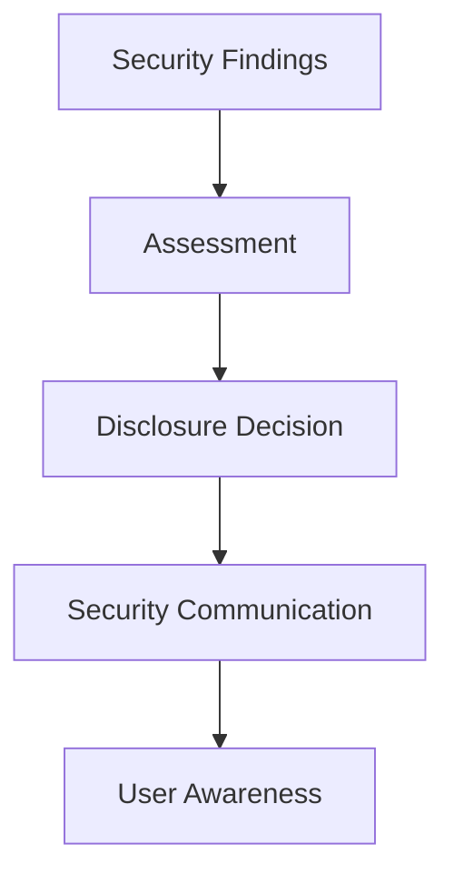

Enigm approaches transparency as a security, privacy, and accountability practice. Public security communication should improve trust, support informed decisions, and help auditors, customers, partners, and engineers understand Enigm’s security posture.

Transparency must also preserve operational safety. Public disclosure should provide useful security information without exposing sensitive details that could increase risk.

This document is intended for security auditors, enterprise customers, technical partners, and security engineers.

## Overview

Enigm believes that transparency improves trust, accountability, and security understanding.

Transparency should balance:

- User trust.
- Privacy.
- Security.
- Operational safety.

The diagram is conceptual and describes the public disclosure decision flow.

## Security Transparency Principles

Enigm security transparency is guided by:

- Accuracy.
- Accountability.
- Timely communication.
- Responsible disclosure.
- Continuous improvement.
- Risk-aware communication.
- Protection of users and platform integrity.
- Data minimization and content confidentiality.

Transparency should support informed review without publishing sensitive security details, exploit instructions, or operational response information.

## Security Advisories

Security advisories may be published when vulnerabilities, security updates, or important security changes affect the platform.

Advisories may describe:

- Affected security area.
- User impact at an appropriate level.
- Available mitigations.
- Security update information.
- Recommended user or administrator action.

Security advisories should provide enough information to support informed decisions while avoiding unnecessary exposure of sensitive technical material.

## Vulnerability Disclosure

Enigm supports responsible vulnerability disclosure.

Security reports are evaluated, validated, and prioritized according to risk. Evaluation may consider technical impact, exploitability, affected users, affected components, and available mitigations.

Disclosure handling should preserve confidentiality while a report is being reviewed and while remediation is being prepared.

## Responsible Disclosure

Researchers are encouraged to report security issues responsibly.

Responsible disclosure is intended to:

- Protect users.
- Support coordinated remediation.
- Preserve evidence for technical review.
- Avoid premature publication of sensitive details.
- Improve security through constructive reporting.

Reports should include enough technical context to support validation without including unnecessary sensitive data.

## Security Communications

Security communications should provide sufficient information to support informed decisions without increasing risk to users.

Security communication should balance:

- Accuracy.
- Timeliness.
- User impact.
- Operational safety.
- Remediation status.
- Disclosure sensitivity.

Communication may vary depending on severity, user impact, remediation availability, and legal or contractual obligations.

## Release Transparency

The platform may publish security-relevant release information.

Release transparency may include:

- Release information.
- Security improvements.
- Security-relevant changes.
- Security update information.
- Guidance for users or administrators.

Release transparency supports auditability and user awareness while preserving sensitive implementation details.

## Ongoing Security Validation

Enigm performs continuous and periodic security validation activities intended to improve accountability, security posture, and public trust.

Validation practices may include:

- Automated vulnerability assessment.
- Infrastructure exposure reviews.
- Security posture validation.
- Configuration reviews.
- Attack surface monitoring.
- Security control validation.
- Periodic adversarial testing.
- Simulated attack exercises.
- Continuous monitoring.
- Security review cycles.

### Periodic Security Assessments

Enigm performs recurring security assessments intended to identify vulnerabilities, misconfigurations, and exposure risks across supported environments.

Assessment outcomes may inform remediation priorities, security advisories, release planning, and governance review where appropriate.

### Adversarial Security Testing

Enigm performs periodic adversarial security exercises intended to simulate attacker behavior and evaluate detection, visibility, and defensive controls.

These exercises are intended to improve:

- Detection capabilities.
- Security monitoring.
- Incident response readiness.
- Defensive controls.
- Security posture.

### Continuous Security Validation

Security controls are reviewed on an ongoing basis through automated and manual validation processes.

Continuous validation supports security awareness, control verification, and improvement of Enigm’s security posture over time.

### Governance

Security reviews occur regularly. Security posture is periodically reassessed, findings are prioritized according to risk, and remediation activities are tracked and verified.

## Compliance and Governance

Enigm security governance is intended to support accountability, review, and continuous improvement.

Governance practices include:

- Information security governance.
- Security review cycles.
- Periodic assessments.
- Periodic independent reviews.
- Annual compliance assessments and audit processes.
- Compliance program activities.
- Alignment with recognized security frameworks.
- Alignment with recognized NIST security guidance and standards.
- Continuous improvement of security controls.

Enigm maintains ISO/IEC 27001:2022 certification as part of its information security governance program.

The public certification scope and certificate link are documented in [Security Assurance](/security/assurance-evidence). This public documentation references the certification without publishing internal audit records, restricted control evidence, internal findings, or assessment workpapers.

Enigm incorporates post-quantum cryptographic algorithms standardized by NIST as part of its cryptographic architecture.

Except where explicitly stated, this documentation does not claim certifications or external approvals. Alignment with recognized security frameworks should be interpreted as architectural alignment unless a specific certification or assessment is separately documented.

## Security Limitations

Transparency improves understanding but cannot eliminate risk.

Limitations include:

- Public documentation cannot disclose every security detail.
- Some details must remain restricted to protect users and platform integrity.
- Vulnerability information may be limited while remediation is in progress.
- Security advisories may summarize impact without publishing exploit details.
- Governance transparency does not ensure the absence of vulnerabilities.
- Release transparency does not replace secure development, signing, or verification.

Transparency should be evaluated as part of Enigm’s broader security model, alongside secure development, incident response, responsible disclosure, release security, and continuous security validation.
