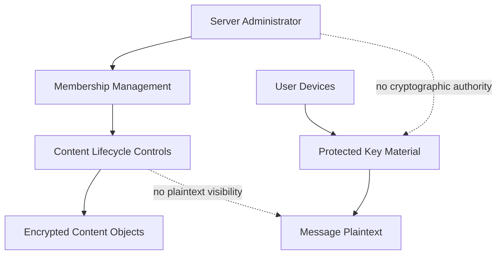

Enigm Server administration and content confidentiality are separate trust domains. Administrative authority allows lifecycle control. It does not provide message visibility, cryptographic authority, attachment plaintext access, user communication access, or private key access.

## Overview

Administrators can manage the lifecycle and availability of server-scoped encrypted content. Administrative deletion controls operate on encrypted content objects and lifecycle state.

Administrative controls do not grant access to:

- Message plaintext.
- Attachment plaintext.
- Multimedia plaintext.
- User communications.
- Private key material.
- Protected key material.
- Cryptographic authority.

## Administrative Capabilities

Administrators can:

- Invite users.
- Remove users.
- Manage server membership.
- Review and approve join requests.
- Manage the lifecycle and availability of server-scoped encrypted content.
- Delete server-scoped encrypted content.
- Delete server-scoped encrypted messages.
- Delete server-scoped encrypted multimedia.
- Delete encrypted content generated by users within that server environment.
- Delete all encrypted content belonging to a specific user within that server environment.
- Delete all encrypted content within the dedicated server environment.
- Delete the entire server environment.

Deletion affects content availability and lifecycle. Deletion does not imply content visibility, content decryption, or plaintext access.

## Administrative Boundaries

Administrative boundaries include:

- Server administration is separate from Enigm App message plaintext.
- Server lifecycle control is separate from private key material.
- Server membership management is separate from Device Trust.
- Server ownership is separate from plaintext access to user content.
- Enigm Command authorization is separate from end-to-end encryption.
- Administrative deletion controls operate on encrypted content objects and lifecycle state.

The diagram is conceptual. It shows that administrator authority and message confidentiality remain separate.

## Relationship With Enigm Command

Enigm Command provides the authenticated administrative surface for Enigm Server operations.

Enigm Command authorization should remain:

- Authenticated.
- Explicitly authorized.
- Scoped to the server environment.
- Auditable where appropriate.
- Separate from protected communication content.

Enigm Command is not a messaging client and does not become a plaintext review surface for Enigm Server content.

## Lawful Use And Abuse Boundaries

Server owners and administrators are responsible for lawful administration of the dedicated server environment, approved membership, lifecycle decisions, and encrypted content availability controls within their authorized boundary.

Enigm Server must not be used to facilitate unlawful activity, prohibited content, abuse, unauthorized access, harassment, exploitation, fraud, sanctions evasion, or other misuse.

Enigm may restrict, suspend, delete, or retire a server environment where required to protect users, preserve platform integrity, satisfy legal or compliance obligations, prevent abuse, or respond to valid security concerns. These lifecycle actions affect availability and service state; they do not create plaintext access, attachment plaintext access, user communication access, private key access, or cryptographic authority.

See [Platform Limitations](/legal/limitations).
