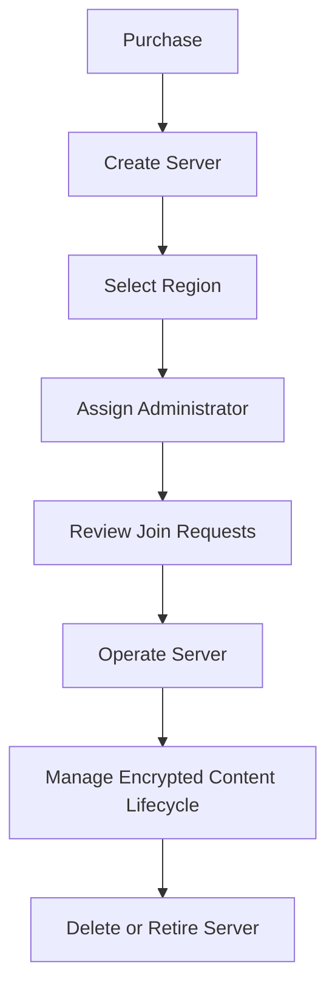

The Enigm Server lifecycle is managed through Enigm Command. Lifecycle authority is commercial and administrative authority; it does not provide message plaintext access, attachment plaintext access, user communication access, private key access, or cryptographic authority.

## Overview

The Enigm Server lifecycle includes purchase, creation, region selection, administrator assignment, membership activation, policy management, content lifecycle management, suspension, deletion, and retirement.

The diagram shows lifecycle stages, not operational deployment topology.

## Purchase And Ownership

Enigm Server is purchased and created through Enigm Command.

The ownership model supports:

- Individual users.
- Teams.
- Organizations.
- Enterprise customers.

The purchaser or assigned owner becomes responsible for the server lifecycle inside the authorized Enigm Command boundary.

Ownership provides administrative lifecycle authority over the dedicated server environment. It does not provide plaintext access to messages, attachments, multimedia, user communications, protected key material, or cryptographic authority.

## Lifecycle Stages

Lifecycle stages include:

1. Server purchase or provisioning request.
2. Dedicated server creation.
3. Geographic deployment region selection.
4. Server owner or administrator assignment.
5. Server ID availability for approved joining workflows.
6. User join request review.
7. Membership activation after administrator approval.
8. Server-scoped policy management.
9. Content lifecycle management.
10. Server suspension, deletion, or retirement according to policy.

Lifecycle records should be minimized and retained only for defined operational, security, legal, or compliance purposes.

## Enterprise And Procurement Model

Enigm Server is designed for customers that require a dedicated private messaging environment with controlled membership and server-scoped lifecycle management.

Enterprise-relevant properties include:

- Dedicated server-scoped messaging environment.
- User-selected public region category.
- Administrative ownership through Enigm Command.
- Server ID based access requests.
- Administrator approval before membership activation.
- Simple role model with administrator and users.
- Server-scoped encrypted content lifecycle controls.
- Separation between administration and message confidentiality.
- Audit visibility for lifecycle and membership events where appropriate.

Enterprise procurement, commercial approval, or subscription state must not be treated as message access authorization. Enigm App account state, Device Trust, protected key material, server membership, and conversation policy remain required for protected workflows.

## Full Server Deletion

Enigm Server supports full server deletion where ownership and policy allow.

Full deletion is intended to support:

- Server retirement.
- Customer-initiated environment closure.
- Removal of server-scoped encrypted objects.
- Server membership and join request lifecycle closure.
- Reduction of unnecessary retention after the server is no longer required.
- Deletion of the entire server environment.

Full server deletion must preserve applicable legal, security, compliance, and operational boundaries.

Full server deletion affects lifecycle and availability of the dedicated server environment. It does not provide access to message plaintext, attachment plaintext, user communications, cryptographic keys, or protected key material.

## Lawful Use And Abuse Response

The server owner or authorized administrator is responsible for lawful administration of the dedicated server environment, approved membership, lifecycle decisions, and encrypted content availability controls within their authorized boundary.

Enigm may restrict, suspend, delete, or retire a server environment where required to protect users, preserve platform integrity, satisfy legal or compliance obligations, prevent abuse, or respond to valid security concerns.

These lifecycle actions affect availability and service state. They do not create plaintext access, attachment plaintext access, user communication access, private key access, or cryptographic authority.

See [Platform Limitations](/legal/limitations).
