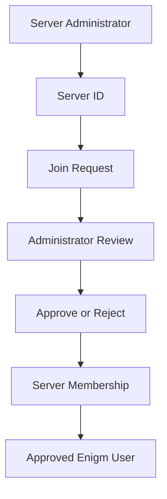

Enigm Server membership is a security-sensitive workflow. A dedicated server environment is available only to approved Enigm users whose account state, Device Trust, membership state, and server policy allow participation.

## Overview

Enigm Server uses a controlled membership model based on server ID join requests and administrator approval.

Membership supports:

- Server ID sharing by the administrator.
- User-initiated join requests.
- Administrator review of pending requests.
- Approval or rejection before membership activation.
- Removal of approved users from the server environment.
- Simple role separation between administrator and users.

The server ID is a join-request locator. It is not an access credential.

## Join Request Model

The server administrator can share the server ID with intended users. Users request access to the dedicated server environment, and the administrator reviews the request before membership is activated.

Possession of a server ID does not:

- Grant membership.
- Bypass administrator approval.
- Establish Device Trust.
- Provide access to encrypted content.
- Provide access to message plaintext.
- Provide access to cryptographic keys.

A user must remain an Enigm user and must satisfy the applicable account, device, membership, and server-policy requirements before participating in the server environment.

## Administrator Capabilities

The server owner or authorized administrator can:

- Share the server ID with intended users.
- Review pending join requests.
- Accept or reject join requests.
- Remove approved users.
- Control server membership.
- Restrict future access according to server policy.

Administrative control is lifecycle authority. It is not cryptographic authority.

## Role Model

Enigm Server uses a simple public role model.

| Role | Responsibility |
| --- | --- |
| Administrator | Server lifecycle, join request review, membership control, and server-scoped encrypted content lifecycle controls. |
| Users | Approved Enigm users who participate in the dedicated server environment according to server policy. |

Enigm Server does not define additional public roles in this documentation.

## Trust Separation

Membership is separate from other trust decisions.

The following concepts remain separate:

- Account Trust.
- Device Trust.
- Server membership.
- Enigm Command administrative authorization.
- Protected key material.
- Message plaintext access.
- Conversation policy.

A valid account is not automatically a trusted device. A trusted device is not automatically a server member. A server member is not automatically authorized to access every conversation or encrypted object.

## Privacy Considerations

Server membership data is minimized and retained only for defined operational, security, legal, or compliance purposes. Membership state should not be treated as proof of message content, message frequency, or conversation meaning.

Privacy-Preserving Device Handles are used where device correlation is required for trust and lifecycle workflows.

See [Platform Limitations](/legal/limitations).
