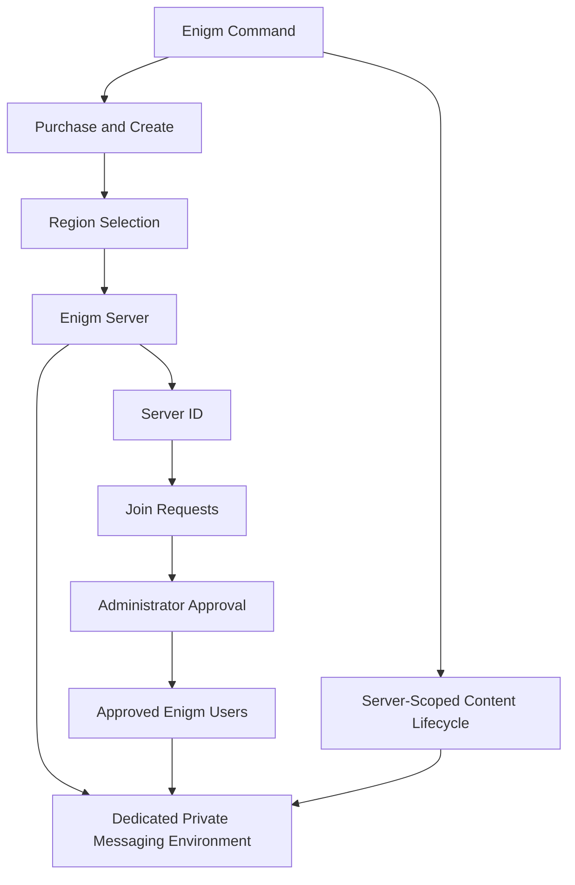
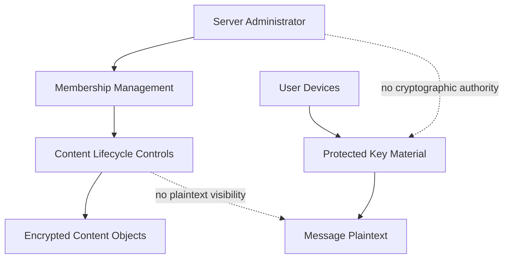

Enigm Server is the dedicated private messaging environment product in the Enigm ecosystem. It allows an individual user, team, or organization to create a controlled private messaging environment for approved Enigm users while preserving Enigm App end-to-end encryption, Device Trust, protected key material, and content confidentiality boundaries.

Enigm Server is purchased, created, and managed from Enigm Command. It is not the VPN Service, not the Proxy Network, and not the Tor Gateway.

## Overview

Enigm Server provides customer-level control over a dedicated private messaging environment.

It supports:

- Dedicated private messaging environments for individual users or organizations.
- Server purchase and creation from Enigm Command.
- User-selected geographic deployment region.
- Server ID based join requests.
- Administrator review and approval of join requests.
- Server membership control.
- Removal of approved users from the server environment.
- Simple role separation between the server administrator and server users.
- Server-scoped content lifecycle controls.
- Message and media availability control.
- Deletion of server-hosted encrypted objects according to policy.
- Deletion of server-scoped encrypted messages and multimedia according to policy.
- Deletion of encrypted content generated by a specific user within the server environment.
- Deletion of all encrypted content within the dedicated server environment.
- Full server content deletion where ownership and policy allow.
- Server lifecycle management.
- Server audit visibility where appropriate.

The diagram is conceptual. It shows product responsibilities, not deployment topology.

## Purchase And Ownership Model

Enigm Server is purchased and created through Enigm Command.

The ownership model supports:

- Individual users.
- Teams.
- Organizations.
- Enterprise customers.

The purchaser or assigned owner becomes responsible for the server lifecycle inside the authorized Enigm Command boundary. Ownership provides administrative lifecycle authority over the dedicated server environment. It does not provide plaintext access to messages, attachments, multimedia, user communications, protected key material, or cryptographic authority.

Enigm Server purchase state is commercial lifecycle state. Commercial authorization is separate from Account Trust, Device Trust, membership approval, conversation policy, and protected content access.

## Enterprise And Procurement Model

Enigm Server is designed for customers that require a dedicated private messaging environment with controlled membership and server-scoped lifecycle management.

Enterprise-relevant properties include:

- Dedicated server-scoped messaging environment.
- User-selected public region category.
- Administrative ownership through Enigm Command.
- Server ID based access requests.
- Administrator approval before membership activation.
- Simple role model with administrator and users.
- Server-scoped encrypted content lifecycle controls.
- Separation between administration and message confidentiality.
- Audit visibility for lifecycle and membership events where appropriate.

Enterprise procurement, commercial approval, or subscription state must not be treated as message access authorization. Enigm App account state, Device Trust, protected key material, server membership, and conversation policy remain required for protected workflows.

## What Enigm Server Is

Enigm Server is a dedicated private messaging environment for users, teams, and organizations that require a controlled server-scoped context inside the Enigm ecosystem.

It is designed to support:

- Customer-controlled private messaging environments.
- Dedicated server lifecycle management.
- Server owner or authorized administrator control.
- Server ID based join request workflows.
- Administrator approval for users requesting access to a server-scoped environment.
- Membership review and removal.
- Simple membership roles: administrator and users.
- Server-scoped lifecycle controls for messages and multimedia.
- Reduced exposure of server membership and activity metadata.
- Separation from global Enigm App message spaces.

Enigm Server provides control over server membership and server-scoped encrypted content lifecycle. It does not change the foundational Enigm App secure messaging model.

## What Enigm Server Is Not

Enigm Server is not:

- The VPN Service.
- The Proxy Network.
- The Tor Gateway.
- A network gateway.
- A replacement for Enigm App secure messaging.
- A bypass around end-to-end encryption.
- A mechanism for administrators to read private message plaintext.
- A mechanism for administrators to receive attachment plaintext.
- A mechanism for administrators to receive user communications.
- A mechanism for administrators to receive cryptographic keys.
- A replacement for Device Trust or protected key material.

Server administration must remain separate from private key material and message plaintext.

## Relationship With Enigm App

Enigm remains the primary private messaging product and the core user-facing app experience.

Approved Enigm users access server-scoped messaging environments through Enigm App when account state, Device Trust, server membership, and server policy allow it.

Enigm App controls remain applicable inside Enigm Server environments:

- Secure messaging.
- Secure calls according to product policy.
- Protected key material.
- Trusted devices.
- Multi-device workflows.
- Message expiration.
- Verification workflows.
- Content confidentiality.

Enigm Server does not replace Enigm App end-to-end encryption. Server membership and server policy affect environment access and encrypted content availability; they do not create plaintext access, attachment plaintext access, user communication access, or cryptographic key access for server administrators.

## Relationship With Enigm Command

Enigm Command is the web control panel and administrative surface for Enigm Server.

Enigm Command supports:

- Enigm Server purchase and management.
- Dedicated server creation.
- Geographic deployment region selection.
- Server lifecycle management.
- Server ID visibility for user join requests.
- Join request review and approval.
- User access management for dedicated servers.
- Server membership control.
- Content lifecycle controls inside dedicated servers.
- Remote deletion workflows for server-owned content.
- Deletion of encrypted content generated by users within that server environment.
- Deletion of all encrypted content belonging to a specific user within that server environment.
- Deletion of all encrypted content within the dedicated server environment.
- Deletion of the entire server environment.
- Server audit visibility where appropriate.

Enigm Command administrative actions must remain authenticated, authorized, scoped, and auditable.

## Dedicated Server Lifecycle

The Enigm Server lifecycle is managed through Enigm Command.

Lifecycle stages include:

1. Server purchase or provisioning request.
2. Dedicated server creation.
3. Geographic deployment region selection.
4. Server owner or administrator assignment.
5. Server ID availability for approved joining workflows.
6. User join request review.
7. Membership activation after administrator approval.
8. Server-scoped policy management.
9. Content lifecycle management.
10. Server suspension, deletion, or retirement according to policy.

Lifecycle records should be minimized and retained only for defined operational, security, legal, or compliance purposes.

## Geographic Region Selection

Enigm Server supports user-selected geographic deployment region selection.

Region selection is intended to support:

- Customer control over server placement.
- Latency and operational requirements.
- Regulatory or contractual considerations.
- Server-scoped policy planning.

Current public region categories include:

- United States.
- Europe.
- Asia.

Region selection is a product and deployment control. It does not change the Enigm legal governance model: Enigm-controlled servers and services are operated under Enigm's Swiss subsidiary and Swiss legal governance.

Region selection does not create plaintext access for administrators, operational systems, hosting environments, or legal workflows. Enigm Server remains bound by Enigm App end-to-end encryption, Device Trust, protected key material, and server-scoped encrypted content lifecycle controls.

Public documentation does not disclose deployment topology, third-party relationship details, server locations, routing mechanics, or operational infrastructure.

## Join Requests And Membership

Enigm Server uses a server ID based membership workflow.

The server administrator can share the server ID with intended users. Users request access to the dedicated server environment, and the administrator reviews and accepts the request before membership is activated.

The server ID is a join-request locator, not an access credential. Possession of a server ID does not grant membership, does not bypass administrator approval, does not establish Device Trust, and does not provide access to encrypted content.

The server owner or authorized administrator can:

- Share the server ID with intended users.
- Review pending join requests.
- Accept or reject join requests.
- Remove approved users.
- Control server membership.
- Restrict future access according to server policy.

Approved users remain Enigm users. Membership in an Enigm Server environment does not remove Enigm App account, Device Trust, key-management, or secure messaging requirements.

## Role Model

Enigm Server uses a simple role model.

The role model includes:

- **Administrator**: the server owner or authorized administrator responsible for server lifecycle, join request review, membership control, and server-scoped encrypted content lifecycle controls.
- **Users**: approved Enigm users who participate in the dedicated server environment according to server policy.

Enigm Server does not define additional public roles in this documentation. Administrative authority remains limited to lifecycle and availability controls. It does not provide plaintext access, attachment plaintext access, user communication access, private key access, or cryptographic authority.

## Server-Scoped Content Lifecycle

Enigm Server supports server-scoped content lifecycle controls.

These controls are intended to manage encrypted content availability inside the dedicated server environment. They can include:

- Server-owned content lifecycle controls.
- Encrypted content deletion.
- Message and media availability control.
- Removal from the server environment.
- Deletion of server-hosted encrypted objects.
- Deletion of server-scoped encrypted messages.
- Deletion of server-scoped encrypted multimedia.
- Deletion of encrypted content generated by users within that server environment.
- Deletion of all encrypted content belonging to a specific user within that server environment.
- Deletion of all encrypted content within the dedicated server environment.
- Lifecycle deletion according to policy.

Administrators can manage the lifecycle and availability of server-scoped encrypted content.

Administrative deletion controls operate on encrypted content objects and lifecycle state. Deletion affects content availability and lifecycle. Deletion does not imply content visibility, content decryption, message plaintext access, attachment plaintext access, user communication access, or cryptographic key access.

Server-scoped encrypted messages, encrypted attachments, encrypted multimedia, and encrypted user-generated content follow the same content lifetime model as Enigm secure messaging. The maximum lifetime is 30 days, unless the conversation policy defines a shorter lifetime or authorized users delete content earlier.

## Message And Media Deletion

The server owner or authorized administrator can delete server-scoped encrypted content according to policy and ownership boundaries.

Deletion workflows can include:

- Deletion of server-scoped encrypted messages.
- Deletion of server-scoped encrypted multimedia.
- Deletion of encrypted content generated by users within that server environment.
- Deletion of all encrypted content belonging to a specific user within that server environment.
- Deletion of all encrypted content within the dedicated server environment.
- Removal of server-hosted encrypted objects.
- Remote deletion workflows for server-owned content.

Administrative controls do not grant access to message plaintext, attachment plaintext, user communications, or private key material.

## Full Server Deletion

Enigm Server supports full server deletion where ownership and policy allow.

Full deletion is intended to support:

- Server retirement.
- Customer-initiated environment closure.
- Removal of server-scoped encrypted objects.
- Server membership and join request lifecycle closure.
- Reduction of unnecessary retention after the server is no longer required.
- Deletion of the entire server environment.

Full server deletion must preserve applicable legal, security, compliance, and operational boundaries.

Full server deletion affects lifecycle and availability of the dedicated server environment. It does not provide access to message plaintext, attachment plaintext, user communications, cryptographic keys, or protected key material.

## Administrative Boundaries

Enigm Server administration and content confidentiality are separate trust domains.

Administrative authority allows lifecycle control. It does not provide message visibility, cryptographic authority, attachment plaintext access, user communication access, or message plaintext access.

Administrators can:

- Invite users.
- Remove users.
- Manage server membership.
- Manage the lifecycle and availability of server-scoped encrypted content.
- Delete server-scoped encrypted content.
- Delete server-scoped encrypted messages.
- Delete server-scoped encrypted multimedia.
- Delete encrypted content generated by users within that server environment.
- Delete all encrypted content belonging to a specific user within that server environment.
- Delete all encrypted content within the dedicated server environment.
- Delete the entire server environment.

Administrative boundaries include:

- Server administration is separate from Enigm App message plaintext.
- Server lifecycle control is separate from private key material.
- Server membership management is separate from Device Trust.
- Server ownership is separate from plaintext access to user content.
- Enigm Command authorization is separate from end-to-end encryption.
- Administrative deletion controls operate on encrypted content objects and lifecycle state.
- Administrative controls do not grant access to message plaintext, attachment plaintext, user communications, or private key material.

The diagram is conceptual. It shows that administrator authority and message confidentiality remain separate. Administrative deletion controls operate on encrypted content objects and lifecycle state, while message plaintext remains dependent on trusted user devices and protected key material.

## Privacy Considerations

Enigm Server follows Enigm privacy-first architecture.

Privacy considerations include:

- Minimize server membership exposure.
- Minimize server lifecycle metadata.
- Use Privacy-Preserving Device Handles for device correlation where device state is required.
- Separate server-scoped metadata from protected message content.
- Limit administrative visibility to required lifecycle and policy context.
- Avoid treating server membership as proof of message content.
- Retain server records only for defined operational, security, legal, or compliance purposes.
- Encrypt server metadata according to the applicable product and storage domain, except for operational identifiers required to route, authenticate, authorize, and maintain the server environment.

Enigm Server is designed to reduce exposure and provide customer-level control without increasing routine collection of protected content.

## Security Limitations

Ver [Platform Limitations](/legal/limitations).

## Threat Model References

Relevant threat-model areas include Enigm Server abuse, account compromise, Device Trust failure, join request misuse, server membership abuse, server-scoped metadata exposure, malicious trusted users, endpoint compromise, Enigm Command abuse, and loss of administrative audit visibility.
