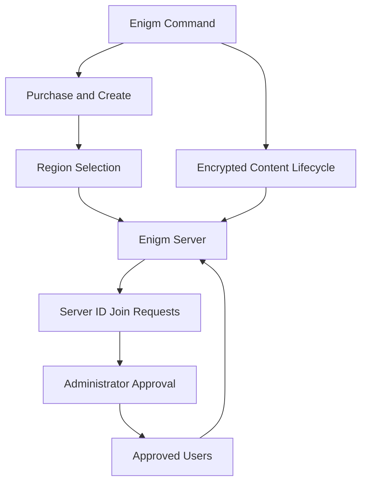

Enigm Server is the dedicated private messaging environment product in the Enigm ecosystem. It allows an individual user, team, or organization to create a controlled server-scoped messaging environment for approved Enigm users while preserving Enigm App end-to-end encryption, Device Trust, protected key material, and content confidentiality boundaries.

Enigm Server is purchased, created, and managed from Enigm Command. It is not the VPN Service, not the Proxy Network, and not the Tor Gateway.

## Overview

Enigm Server provides customer-level control over a dedicated private messaging environment.

It supports:

- Dedicated private messaging environments for individual users, teams, organizations, and enterprise customers.
- Server purchase and creation from Enigm Command.
- User-selected geographic deployment region.
- Server ID based join requests.
- Administrator review and approval of join requests.
- Server membership control and user removal.
- Simple role separation between administrator and users.
- Server-scoped encrypted content lifecycle controls.
- Deletion of encrypted messages, attachments, multimedia, and user-generated encrypted content within the server environment.
- Full server environment deletion where ownership and policy allow.
- Server audit visibility where appropriate.

The diagram is conceptual. It shows product responsibilities, not deployment topology.

## Product Boundaries

Enigm Server provides a dedicated administrative and membership boundary for server-scoped messaging. It does not replace the Enigm App secure messaging model.

Enigm Server is not:

- A network gateway.
- A replacement for Enigm App secure messaging.
- A bypass around end-to-end encryption.
- A plaintext message review surface.
- A mechanism for administrators to receive attachment plaintext.
- A mechanism for administrators to receive user communications.
- A mechanism for administrators to receive cryptographic keys.
- A replacement for Device Trust or protected key material.

Server administration must remain separate from private key material and message plaintext.

## Relationship With Enigm App

Approved Enigm users access server-scoped messaging environments through Enigm App when account state, Device Trust, server membership, protected key material, and server policy allow it.

Enigm App controls remain applicable inside Enigm Server environments:

- Secure messaging.
- Secure calls according to product policy.
- Protected key material.
- Trusted devices.
- Multi-device workflows.
- Message expiration.
- Verification workflows.
- Content confidentiality.

Server membership and server policy affect environment access and encrypted content availability. They do not create plaintext access, attachment plaintext access, user communication access, or cryptographic key access for server administrators.

## Relationship With Enigm Command

Enigm Command is the administrative surface for Enigm Server.

Enigm Command supports:

- Enigm Server purchase and management.
- Dedicated server creation.
- Geographic deployment region selection.
- Server lifecycle management.
- Server ID visibility for user join requests.
- Join request review and approval.
- Membership control.
- Server-scoped encrypted content lifecycle controls.
- Full server deletion where ownership and policy allow.

Enigm Command administrative actions must remain authenticated, authorized, scoped, and auditable.

## Documentation Map

- [Membership and Roles](/server/membership) explains server ID join requests, administrator approval, membership, and the role model.
- [Administration Boundaries](/server/administration) explains what administrators can control and what they cannot see.
- [Content Lifecycle](/server/content-lifecycle) explains encrypted message, media, attachment, and server-scoped content deletion.
- [Regions and Deployment](/server/regions) explains region selection and legal governance boundaries.
- [Server Lifecycle](/server/lifecycle) explains purchase, creation, suspension, deletion, and retirement.

## Privacy Considerations

Enigm Server follows Enigm privacy-first architecture. Server-scoped metadata is minimized, purpose-limited, access-controlled, and partially encrypted according to the applicable product and storage domain while preserving only operational identifiers required to route, authenticate, authorize, and maintain the server environment.

Enigm Server is designed to provide customer-level control without increasing routine collection of protected content.

See [Platform Limitations](/legal/limitations).
